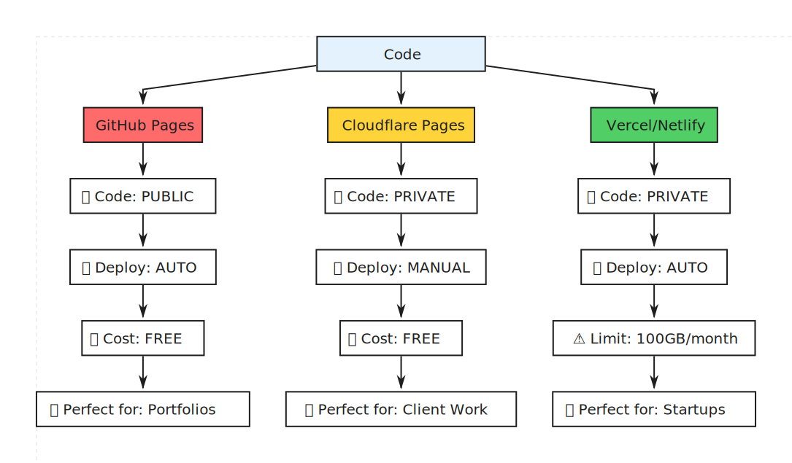

# Going Live with GitHub Pages

## Deployment Options Comparison

- **GitHub Pages**: Free, automatic CI/CD, public code
- **Cloudflare**: Private code, manual updates
- **Vercel**: Private code, 100GB limit

## GitHub Setup Steps

1. **Create Repository**

    - Go to github.com
    - New repository → 'anna-portfolio'
    - Public → Create

2. **Upload Code**

    - Drag folder into GitHub
    - Or use git commands

3. **Enable GitHub Pages**

    - Settings → Pages
    - Source: Deploy from branch
    - Main → Root → Save

4. **Magic Moment**

    - Wait 2 minutes
    - Live at: username.github.io/anna-portfolio

## Custom Domain Setup

- Add CNAME file
- Configure DNS
- Result: abyzova.com

## CI/CD Explained
Push code → GitHub receives → Actions run → Site updates automatically

---

  

    <a href="../06-master-prompt/" style="text-decoration: none;">
      
← Previous

      
Master Prompt

    </a>
  

  

    <a href="../08-closing/" style="text-decoration: none;">
      
Next →

      
Closing

    </a>
  

<\!-- End of content -->
