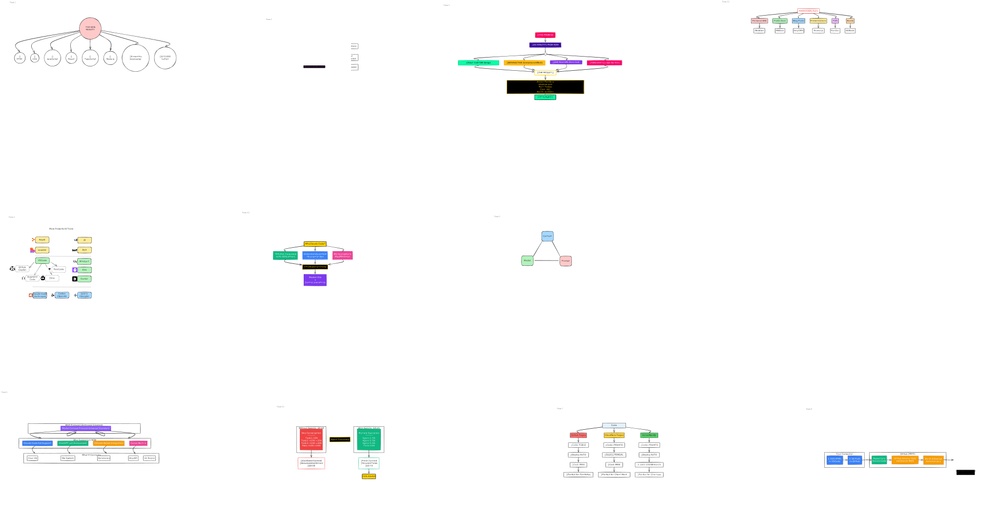

# Episode 01 - All Diagrams

## Complete Visual Guide

<picture>
  <source media="(prefers-color-scheme: dark)" srcset="all-diagrams-dark.svg">
  <source media="(prefers-color-scheme: light)" srcset="all-diagrams-light.svg">
  
</picture>

## Diagram Contents

This comprehensive diagram includes all visual elements from Episode 01:

### 📊 Frame 1: The New Reality
What you no longer need to learn - HTML, CSS, JavaScript, React, TypeScript, Node.js, and more. The traditional learning path that's becoming obsolete.

### ⏰ Frame 2: The 12-Month Window
We're in a unique opportunity window where AI knowledge gives you an incredible competitive advantage over traditional developers.

### 🎯 Frame 3: What You'll Build
Three complete portfolio websites with:
- Custom designs (not templates)
- Interactive features and animations
- Professional deployment pipeline
- Zero monthly fees

### 🛠️ Frame 4: AI Tools Landscape
The three-layer ecosystem of AI development tools:
- **Top Layer (Yellow)**: No-code platforms - Replit, v0, Lovable, Bolt
- **Middle Layer (Green)**: IDE integrations - VSCode, Windsurf, Cursor, Kiro
- **Bottom Layer (Blue)**: CLI tools - Claude Code, Codex, Gemini

### 💻 Frame 5: Claude Code Installation
Complete setup process including:
- Installation commands
- Context and token management
- System requirements

### 🤖 Frame 6: Agent Creation
Building your specialized UI/UX expert agent with:
- Agent definition prompts
- Specialization settings
- Best practices

### 🚀 Frame 7: GitHub Deployment
Deployment workflow showing:
- GitHub Pages setup
- CI/CD pipeline
- Custom domain configuration

---

## Download Options

- [Download Original Excalidraw File](all-diagrams.excalidraw)
- [Light Theme SVG](all-diagrams-light.svg)
- [Dark Theme SVG](all-diagrams-dark.svg)

!!! tip "Best Viewing Experience"
    - **On this page**: The diagram automatically switches between light and dark themes based on your system preferences
    - **In Obsidian**: Open the `.excalidraw` file with the Excalidraw plugin for interactive editing
    - **For presentations**: Download the SVG files for high-quality scalable graphics