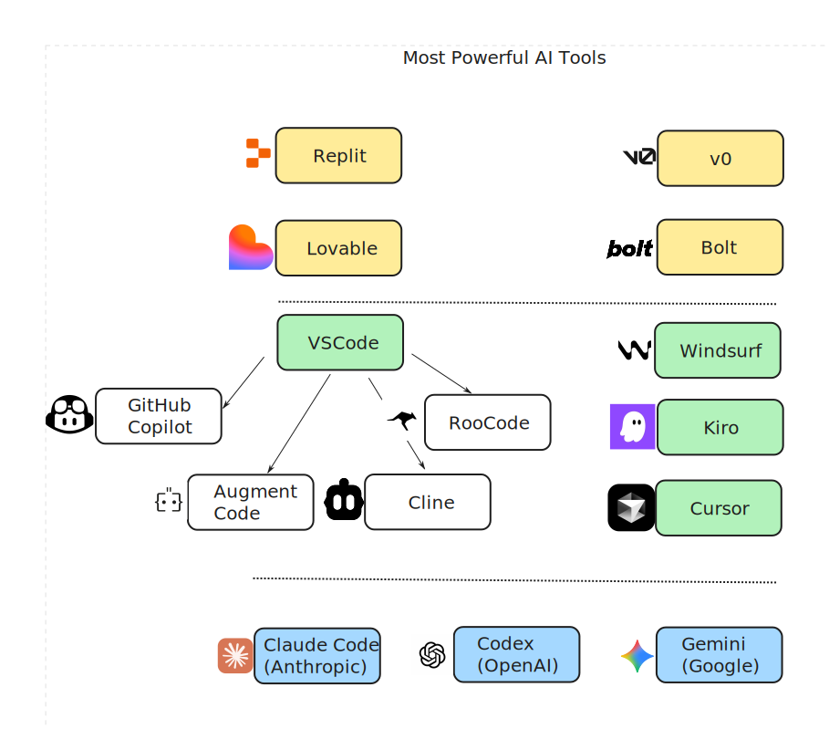
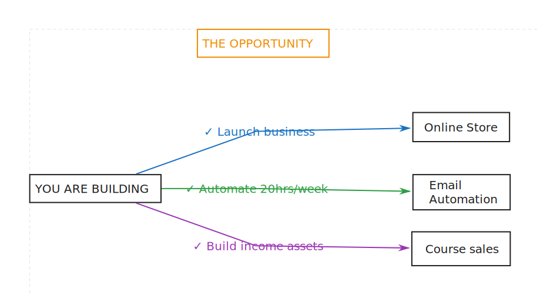
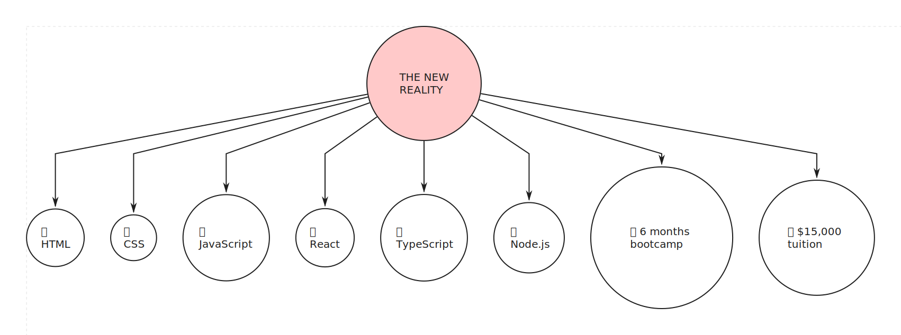
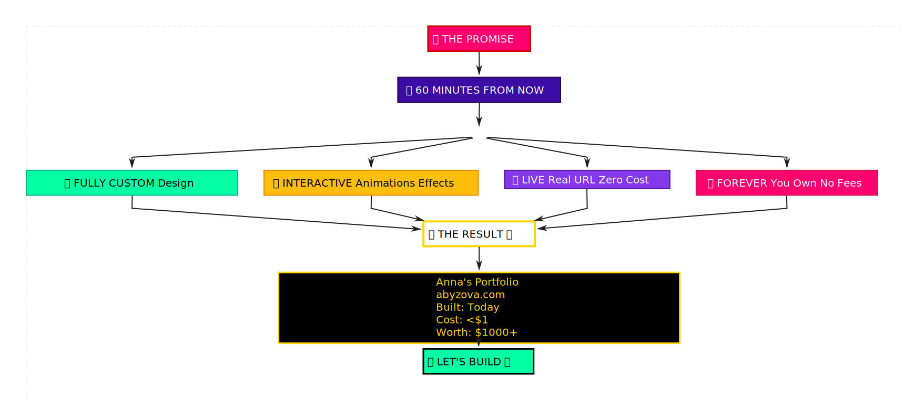

# Episode 01: Portfolio Without Code 🚀

## 🎯 What You'll Learn

- Build 3 professional portfolio websites
- Use Claude Code AI assistant effectively
- Deploy to GitHub Pages (completely free)
- Create custom designs without templates

## 🔧 The AI Stack

| TOOL | PURPOSE | COST | WHY WE USE IT |
|------|---------|------|---------------|
| **Claude** | AI Programming Assistant | $20/month | Most intelligent AI coder available |
| **Obsidian** | Knowledge Management | FREE | Perfect for organizing content |
| **GitHub Pages** | Website Hosting | FREE | Professional hosting, no limits |
| **Markdown** | Content Format | FREE | Simple, powerful, universal |

## 💡 The 12-Month Window

We have maybe 12 months where knowing this gives you an INSANE advantage.

## ❌ What You DON'T Need

- HTML
- CSS
- JavaScript
- React
- TypeScript
- Node.js
- 6 months bootcamp
- $15,000 tuition

## ✨ What You DO Need

- **20 minutes** to follow along
- **Claude** ($20/month)
- **GitHub account** (free)
- **Your content** (about me, projects, contact)

## 🚀 Quick Start

-   :material-clock-fast:{ .lg .middle } __Watch the Full Episode__

    ---

    Learn step-by-step how to build professional websites without coding

    [:octicons-arrow-right-24: Start from Beginning](content/00-introduction.md)

-   :material-rocket-launch:{ .lg .middle } __Jump to Key Sections__

    ---

    Skip to the part you need most

    [:octicons-arrow-right-24: Obsidian Setup](content/01-obsidian-setup.md)
    [:octicons-arrow-right-24: Claude Install](content/03-claude-code-install.md)
    [:octicons-arrow-right-24: Master Prompt](content/06-master-prompt.md)
    [:octicons-arrow-right-24: GitHub Deploy](content/07-github-deploy.md)

-   :material-file-document:{ .lg .middle } __Get the Prompts__

    ---

    Copy the exact prompts I use

    [:octicons-arrow-right-24: Agent Definition](prompts/agent-definition.md)
    [:octicons-arrow-right-24: Master Prompt](prompts/master-prompt.md)

-   :material-book-open-variant:{ .lg .middle } __Resources__

    ---

    All links and materials mentioned

    [:octicons-arrow-right-24: View Resources](../../episodes/RESOURCES.md)

## 📺 Video Sections

| Timestamp | Topic | What You'll Learn |
|-----------|-------|-------------------|
| [00:00](content/00-introduction.md) | **Introduction** | The $10K secret and what's possible |
| [05:11](content/01-obsidian-setup.md) | **Obsidian Setup** | Installing and configuring your content system |
| [10:11](content/02-ai-tools-landscape.md) | **AI Tools Landscape** | Understanding the tools available |
| [13:32](content/03-claude-code-install.md) | **Claude Install** | Setting up your AI coding assistant |
| [16:03](content/04-agent-creation.md) | **Agent Creation** | Building your personalized AI agent |
| [21:43](content/05-portfolio-prep.md) | **Portfolio Preparation** | Organizing your content |
| [27:17](content/06-master-prompt.md) | **Master Prompt** | The exact prompt for building websites |
| [31:28](content/07-github-deploy.md) | **GitHub Deploy** | Publishing your site live |
| [42:52](content/08-closing.md) | **Closing** | Next steps and community |

## 🎓 Ready to Start?

    <a href="content/00-introduction.md" class="md-button md-button--primary" style="padding: 1rem 2rem; font-size: 1.2rem;">
        ▶️ Start Learning Now
    </a>

---

    
📧 Questions? Join our community on <a href="https://discord.gg/YOUR-DISCORD">Discord</a>

    
📺 New episodes every week on <a href="https://youtube.com/@antonabyzov">YouTube</a>

