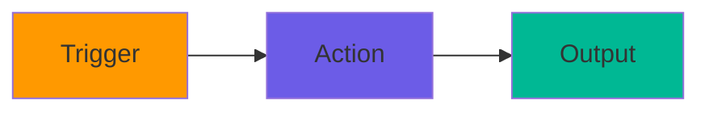
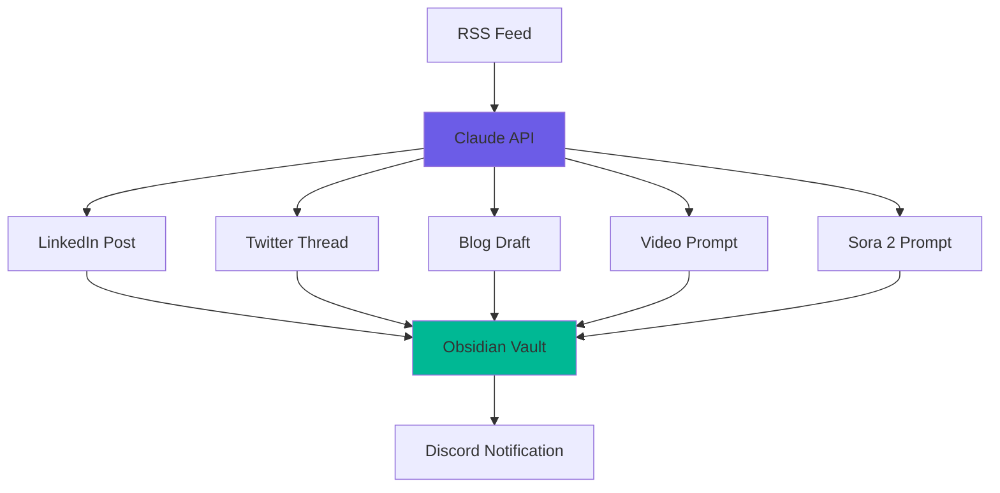
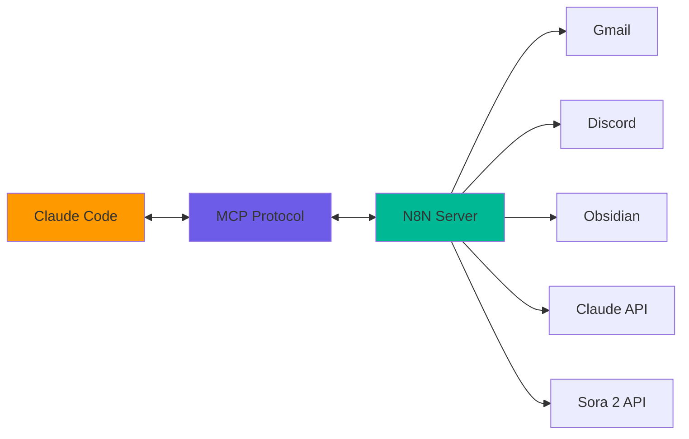

# 📹 THE FULL SCRIPT - Episode 03
## N8N Automation Superpowers with Sora 2 AI Videos

**UPDATED:** October 12, 2025
**Sora 2 Released:** September 30, 2025
**N8N Version:** 1.60+ (latest stable)

---

## 🎬 VIDEO TITLES (SEO-Optimized Options)

**Primary Title (Recommended):**
```
N8N Automation + Sora 2 AI: Build Workflows That Run Your Business (Step-by-Step)
```

**Alternative Titles:**
1. "N8N Tutorial 2025: Automate Everything with AI (Claude + Sora 2 Integration)"
2. "I Automated My Entire Workflow with N8N - 40 Hours Saved Per Week"
3. "N8N + Claude Code: Build AI Automation Agents That Actually Work"
4. "Stop Manual Work: N8N Automation with AI (Better Than Zapier)"

**SEO Keywords:** N8N tutorial, workflow automation, Claude Code, Sora 2, AI automation, MCP, Model Context Protocol, Zapier alternative, no-code automation, AI agents

---

## ⏱️ VIDEO STRUCTURE

**Total Duration:** 18-19 minutes (includes 100 seconds of Sora 2 videos + live generation demo)
**Production Method:**
- 2 on-camera segments (Hook + Closing) = 2 minutes
- 20+ screen recordings = 14-15 minutes
- **10 Sora 2 AI-generated videos (100 seconds total)** for cinematic B-roll + live demo + epic ending

**Key Sections:**
- 0:00-0:10: **🏢 SORA 2 VIDEO #1** - Burj Khalifa Climb & Jump (10 sec) - INSTANT VISUAL HOOK
- 0:10-0:20: **⚽ SORA 2 VIDEO #2** - UEFA Champions League Final (10 sec) - VICTORY MOMENT
- 0:20-0:35: Quick Intro - Who I Am (15 sec)
- 0:35-1:15: Dashboard + Context (40 sec)
- 1:15-1:55: **Sora 2 Access Intro** (40 sec)
- 1:55-3:30: **Sora 2 Detailed Pricing & Warnings** (95 sec)
- 3:30-4:45: What Is N8N? (75 sec)
- 4:45-6:05: Installation (Standalone/Docker/Cloud) (80 sec)
- 6:05-6:15: **👨‍💻 SORA 2 VIDEO #3** - Sam Altman Coding (10 sec)
- 6:15-7:05: Why N8N vs Zapier/Make (50 sec)
- 7:05-9:35: First Workflow - Sora 2 AI Video Generator (150 sec)
- 9:35-9:45: **🏄 SORA 2 VIDEO #4** - 80-Foot Wave Surfing (10 sec)
- 9:45-9:55: **🎤 SORA 2 VIDEO #5** - Huge Stage Performance (10 sec)
- 9:55-11:55: Advanced Workflow - Claude Code Integration (120 sec)
- 11:55-13:00: Real-World Example #1 - Content Pipeline + LIVE Sora 2 API Demo (65 sec)
- 13:00-13:10: **🏗️ SORA 2 VIDEO #6** - Architectural Blueprint (10 sec) - Business Example
- 13:10-14:10: Real-World Example #2 - Real Estate Automation (60 sec)
- 14:00-14:10: **👽 SORA 2 VIDEO #7** - ISS First Contact (10 sec) - MEGA VIRAL
- 14:10-15:10: MCP Integration (N8N-MCP) (60 sec)
- 15:10-16:30: Results & Time Saved (80 sec)
- 16:30-16:40: **💼 SORA 2 VIDEO #8** - $25M Investment Deal Signing (Sam Altman + EasyChamp) (10 sec) - POWER CLOSER
- 16:40-18:00: Closing + Next Steps (80 sec)
- 18:00-18:10: **🎢 SORA 2 VIDEO #9** - ROLLERCOASTER + PARAPLANE INTO STADIUM (10 sec) - MEGA VIRAL ENDING
- 18:10-18:20: End Screen (10 sec)

---

## 🔥 HOOK (0:00-1:55)

### Part 1: INSTANT VISUAL IMPACT - NO TALKING (10 seconds)

**🏢 SORA 2 VIDEO #1** (10 seconds) - Burj Khalifa Climb & Jump

**FULL-SCREEN VIDEO - NO INTRO CARD, NO LOGO, PURE CINEMA**

**Quick Summary:** @aabyzov climbing exterior of Burj Khalifa (world's tallest building), Mission Impossible Tom Cruise style, 1,200 feet up, death-defying jump between glass panels, Dubai skyline below, GoPro POV + drone shots.

**Full Prompt:** See `SORA_2_VIDEO_PROMPTS.md` → Prompt #16

**AUDIO:**
- **Video's natural audio** (wind, climbing sounds, Dubai ambient)
- **Dramatic orchestral music** (Hans Zimmer style, building intensity)
- **NO VOICEOVER** - Let the visual shock them

**VISUAL BREAKDOWN:**
```
[0:00-0:02] Wide establishing shot: Burj Khalifa towering over Dubai
[0:02-0:04] Zoom to @aabyzov on exterior glass wall, 1,200 feet up
[0:04-0:06] Close-up: Intense focus, hands gripping, breath visible
[0:06-0:07] THE JUMP - mid-air freeze frame between glass panels
[0:07-0:09] Landing on opposite panel, Dubai cityscape below
[0:09-0:10] Wide shot: Tiny figure against massive tower
```

**ON-SCREEN TEXT:**
- [0:03] "1,200 FEET"
- [0:06] "ONE JUMP"

**Editing Notes:**
- FULL VOLUME music - make it LOUD
- No talking whatsoever - pure visual impact
- Viewer reaction: "WTF AM I WATCHING!?"
- They MUST continue to understand
- NO intro card, NO channel logo, straight into video

---

### Part 2: SECOND VISUAL PUNCH (10 seconds)

**⚽ SORA 2 VIDEO #2** (10 seconds) - UEFA Champions League Final - Goal & Trophy

**Quick Summary:** @aabyzov scoring chip goal over goalkeeper at Wembley Stadium (Liverpool #10), ball hits net, celebration run, trophy lift as captain with entire Liverpool squad, confetti falling, "Big Ears" trophy above head.

**Full Prompt:** See `SORA_2_VIDEO_PROMPTS.md` → Prompt #3

**VOICEOVER STARTS AT 0:15** (middle of this video):

**VISUAL BREAKDOWN:**
```
[0:10-0:12] @aabyzov dribbling past defender, Wembley Stadium
[0:12-0:14] Chip shot over goalkeeper - perfect technique
[0:14-0:15] Ball hits back of net - GOAL!
[0:15-0:17] Celebration run, Liverpool teammates joining
[0:17-0:18] Trophy lift as captain, "Big Ears" above head
[0:18-0:20] Confetti falling, entire squad celebrating, 90,000 fans roaring
```

**Voiceover (starts at 0:15 as trophy lifts):**
```
"[0:15 - as trophy lifts] Everything you just saw?

[0:17 - confetti falls] Made with AI.

[0:19 - celebration] In less than 30 minutes, you'll learn how.

**Subscribe now** - this gets wild."
```

**ON-SCREEN TEXT:**
- [0:15] "MADE WITH AI"
- [0:17] "SORA 2 BY OPENAI"
- [0:19] "WATCH..."

**AUDIO:**
- [0:10-0:15] Stadium sounds, crowd roaring, football commentary energy
- [0:15-0:20] Epic sports orchestral music swells
- [0:15+] Your voiceover begins

**Editing Notes:**
- Music transitions from Burj intensity to sports triumph
- Voiceover ONLY starts at 0:15 - let first 5 seconds breathe
- "Liverpool FC" and "@aabyzov #10" clearly visible
- Confetti moment = emotional peak
- Creates "WHAT IS HAPPENING" viewer reaction

---

### Part 3: QUICK INTRO - WHO I AM (15 seconds)

**📹 YOU ON CAMERA** (15 seconds)

**Camera Setup:** Clean background, direct eye contact, confident posture

**Visual:** Tight framing on your face, professional but energetic

**Script:**
```
"I'm Anton Abyzov.

Those videos? Created with Sora 2.

OpenAI's video generator.

Released September 30, 2025.

Here's why this matters for YOUR business."
```

**ON-SCREEN TEXT:**
- "Anton Abyzov"
- "Sora 2: Sept 30, 2025"
- "OpenAI"

**Editing Notes:**
- Fast cut from UEFA confetti to you
- High energy, no wasted words
- 3 seconds per statement
- Sets credibility immediately

---

### Part 4: DASHBOARD + CONTEXT (40 seconds)

**📹 SCREEN: Your N8N Dashboard**

**What to show:**
- N8N use case pages from n8n.io (Sales, DevOps, SecOps, IT Ops)
- Example workflow: "Talk to Google Sheets using ChatGPT" (n8n.io/workflows/7639)
- Example workflow: Simple email automation
- N8N AI agents page (n8n.io/ai-agents)

**Voiceover:**
```
"Last week, I saved 40 hours.

[Show YOUR resume automation workflow in N8N - 3 seconds]

This is my resume fine-tuning automation. Episode 02.
Job posting arrives → Claude analyzes → Resume tailored automatically.

[Switch tab to n8n.io/workflows - 2 seconds]

But with automation tools, which you could use for free locally, N8N does way more than this.

[Show lead management workflow: n8n.io/workflows/2089]

Lead management. Automatic CRM enrichment. LinkedIn data pulled automatically.

[Show AI spreadsheet workflow: n8n.io/workflows/7639]

Talk to your spreadsheets with AI. Ask questions in plain English. Get answers instantly.

[Show customer support workflow: n8n.io/workflows/1962]

AI customer support. Instant replies. 24/7 availability. Human quality.

[Show content creation workflow: n8n.io/workflows/3045]

Content creation automated. One input, multiple outputs across platforms.

[Quick montage of workflow thumbnails - 2 seconds]

All automatic. Zero manual work. While you sleep.

[Cut back to you on camera - 2 seconds]

And the best part? N8N integrates with Sora 2 API.

That's right - AI video generation inside your workflows.

Product demos. Marketing videos. Content creation. All automated.

But before we build that - you NEED to know the costs and access requirements.

This part is CRITICAL. Don't skip it."
```

**ON-SCREEN TEXT:**
- "40 HOURS SAVED"
- "Sales • DevOps • AI Agents"
- "FREE TO START"
- "⚠️ COSTS & ACCESS NEXT"

**Editing Notes:**
- Show n8n.io use case pages clearly
- Fast cuts between different examples
- Highlight AI agents and automation examples
- "40 Hours Saved" emphasized visually
- Build urgency for what's coming
- Quick camera cut at end creates anticipation

---

### Part 5: SORA 2 ACCESS INTRO (40 seconds)

**📹 SCREEN: sora.com + App Store**

**Open:** https://sora.com and show App Store page

**Voiceover:**
```
"Sora 2 released September 30, 2025.

[Show sora.com homepage]

Three ways to access it:

[Show iOS app]
Option 1: iOS app. Available now in US and Canada.
Perfect for testing prompts.

[Show web interface]
Option 2: Web interface at sora.com.
Same features, works in any browser.

[Show API documentation]
Option 3: API for automation. **This is available RIGHT NOW.**

[Show platform.openai.com organization verification badge]

But you need organization verification to access the API state-issued document like driver.


[Show pricing page]

Sora 2 API costs $0.10 to $0.50 PER SECOND.

That's $5 for a 10-second HD video.
$50 for 100 seconds of content.

[Show warning]

For business automation? You could spend hundreds per month.

[Pricing optoin]

Pricing options:
- Free: Limited access with invite
- ChatGPT Plus: $20/month and access via invite
- ChatGPT Pro: $200/month

What's the difference?

**Plus ($20/mo):** This is what most people need.
- Unlimited Sora 2 access, up to 30 videos per day
- Videos up to 10 seconds
- Priority during peak times
- **Important:** Downloaded videos have "SORA" watermark
- Perfect for testing, learning, personal projects

**Pro ($200/mo):** For serious creators and businesses.
- Everything in Plus
- 500 videos/month
- Longer videos (up to 20 seconds)
- **NO watermark** on downloaded videos
- Faster generation, priority access to new features

**For this tutorial?** Plus is more than enough.
10-second videos, watermark is fine for learning.


```

**ON-SCREEN TEXT:**
- "Released: Sept 30, 2025"
- "3 Access Methods"
- "$0.10-$0.50 PER SECOND"
- "This Tutorial: $40"
- "⚠️ NEXT: FULL BREAKDOWN"

**Editing Notes:**
- Show each access method clearly (2-3 seconds each)
- Emphasize the "$0.10-$0.50 PER SECOND" dramatically
- Calculator visual for tutorial cost
- Build to detailed section with urgency
- Red warning text for impact

---

### Part 6: SORA 2 DETAILED PRICING & WARNINGS (95 seconds)

**📹 SCREEN: Sora 2 Official Page + Mobile App**

**Open:** https://sora.com and App Store page

**Voiceover:**
```


**🌍 IMPORTANT: Outside US/Canada?**

Let's look at the mobile iOS Sora 2 application, which is officially available in US and Canada only. But the reality is that many international users access it with the help of VPN tools.

[Show iPhone screen mirrored to OBS]

**📱 iOS App Demo - Full Walkthrough:**

I'll demonstrate the iOS app by connecting my iPhone to show the mobile experience.

[Show iOS home screen → Open Sora app]

If you've got an invite and logged in with your ChatGPT account, here's what you see:

[Show app loading → Main screen appears]

**Quick note:** While recording this, I discovered the Sora mobile app has internet connectivity issues when the iPhone is connected via cable to a Mac recording through QuickTime. By the way, Sora 2 just became the #1 iOS app by downloads in the US! So I'll switch to the web version at sora.com - it has exactly the same functionality, though it's noticeably slower and can make the computer sluggish. I usually close and reopen it every minute or so, especially once I see "Added to queue" after submitting a video prompt.

**Main Feed (Home Page):**

[Show scrolling through feed]

This is the main feed - like Instagram or TikTok. Community videos. Trending prompts. Sora 2 showcases.

Scroll through, like and follow creators. See what others are creating. Get inspired.

Each video shows the prompt used. Tap to see details.

Filter at the top to find specific ones, e.g. for sport


[Tap on a video to show details]

**Profile Page:**

[Navigate to Profile tab]

Tap your profile icon. Here's where your creations live.

Three sections:
- **Posts:** Published videos, visible to community
- **Drafts:** Work in progress, private
- **Liked:** Videos you've saved

[Show each section]

**Cameo Feature - THIS IS POWERFUL:**

[Tap "Create" → "Upload Cameo"]

Cameo. This is where it gets personal.

Upload a short video of yourself. Sora 2 learns your appearance.


[Show upload interface]

Once uploaded, reference yourself in prompts with @aabyzov tag.

[Type prompt in text field]

Sora 2 generates YOU in the video. Your face. Your likeness. Cinematic quality.

[Show generation starting]

**Creating a Video:**

[Show create interface]

Let me create a video right now with this prompt:

Choose landscape of portrait

"@sama welcomes @aabyzov as the new CTO of the OpenAI company in their office, modern tech office, San Francisco skyline visible through windows, professional business attire, handshake, celebration, cinematic lighting. And just to make it more interesting add image - logo of my company easychamp - use this image somewhere related to me" 

[Type full prompt]

**Settings:**
- **Duration:** 5s, 10s, 15s, 20s (I'm choosing 10s)
- **Aspect Ratio:** Landscape (16:9) or Portrait (9:16)
- **Quality:** Standard or HD

[Show selecting options]

If your video doesn’t violate any policies — including third-party likeness (e.g. brands like Real Madrid) — it should appear in your drafts after 2–5 minutes. Try refreshing the page.

[Show loading spinner]

**While Generating - Exploring Drafts:**

[Navigate to Drafts tab]

Drafts tab. Everything you've created but haven't posted yet.

Videos stay here until you move them to Posts.

Review. Edit. Remix. Delete.

[Show draft videos]

**Remix Feature:**

[Tap on a draft video → Show "Remix" button]

Remix. THIS is genius.

Take any video you've created. Add new details to the original prompt.

I go to my posted video - @sama gives $25M to EasyChamp and try to remix, but it violates the fraudulent or scam activity.

Sora 2 regenerates with your additions. Iterative creation.

[Show remix interface]

**Download Options:**

[Go back to completed video]

Video finished generating. Let's check it out.

[Show generated video playing]

Perfect. @sama welcoming me to OpenAI. Cinematic office scene. Exactly as prompted.

Now tap Download.

[Show download options]

Two options:
- **Save to Camera Roll:** Download to iPhone
- **Share:** Post to social media, AirDrop, etc.

[Tap "Save to Camera Roll"]

**Remember:** Plus ($20/mo) has "SORA" watermark on downloads.
Pro ($200/mo) has NO watermark.

[Show watermark briefly if visible]

**From Drafts to Posts:**

[Navigate back to Drafts]

Happy with your video? Move it from Drafts to Posts.

[Tap video → "Post" button]

Now it's public. Community can see it. Like, comment, remix your prompt.

[Show posting confirmation]

**Like & Discover:**

[Navigate to main feed]

See something you love? Tap the heart icon. Just like Instagram.

[Show liking a video]

Liked videos save to your profile. Build your inspiration library.

**Landscape vs Portrait:**

[Show aspect ratio selector]

One more thing: Aspect ratio matters.

Landscape (16:9): Cinematic, YouTube, TV screens
Portrait (9:16): TikTok, Instagram Reels, mobile-first

Choose based on where you're posting.

[Pause]

**Android?** Not yet available. No release date announced. iOS only for now.

[Close app demo]

That's the mobile experience. 


Gorgeous interface. Powerful features.

**🎁 SPECIAL OFFER FOR THIS VIDEO:**

I have 5 Sora 2 invite codes to give away.

First 5 people who post a thoughtful comment below - a genuine question,
a workflow idea, or how you'll use N8N - will receive an invite code on their youtube email connected.

```

**On-Screen Text Overlays:**
- "iOS: Available Now | Android: Coming Soon"
- "API: AVAILABLE NOW (Org Verification Required)"
- "Standard: $0.10/sec | HD: $0.50/sec"
- "⚠️ SET SPENDING LIMITS ⚠️"
- "✅ Verification: 1-2 Business Days"

**Editing Notes:**
- Show pricing page clearly
- Add cost calculator graphics
- Emphasize warnings with red text
- Show OpenAI billing limits page
- "Security First" badge
- Keep it serious - this is important

---

### Part 4: YOU ON CAMERA - The Promise (15 seconds)

**📹 YOU ON CAMERA**

**Camera Setup:** Clean background, good lighting, direct eye contact

**Script:**
```
"
Now let's jump into the automation part.

You'll install N8N.
Build your first workflow.

No fluff. Just builds.

Let's go."
```

**Recording Tips:**
- Confident, direct
- Quick pace
- Energy high
- End with action

---

## 📊 WHAT IS N8N? (1:15-2:30)

### Part 1: The Visual Explanation (45 seconds)

**📹 SCREEN: N8N Official Website + Demo Dashboard**

**Open:** https://n8n.io

**Actions:**
1. Show homepage - clean, modern interface
2. Show tagline: "Fair-code workflow automation"
3. Click "See what's possible" or demo
4. Show visual workflow builder
5. Show integration list: 400+ apps

**Voiceover:**
```
"N8N. Fair-code workflow automation.

[Show homepage]

Think Zapier or Make.com, but:
- Self-hosted: Your data, your server
- No limits: Unlimited workflows, unlimited executions
- Open source: Free forever
- Code when needed: JavaScript for custom logic

[Show workflow builder]

Visual workflow builder. No code required.
But code available when you need it.

[Show integration list]

400+ integrations. Gmail, Discord, Obsidian, Google Sheets, Claude AI, OpenAI.
If it has an API, N8N connects to it.

[Pause]

Perfect for automation that actually matters."
```

**Editing Notes:**
- Show clean interface clearly
- Highlight "Fair-code" badge
- Quick scroll through integrations
- "400+ Apps" text overlay

---

### Part 2: The Power Statement (30 seconds)

**📹 SCREEN: Quick Workflow Examples**

**What to show:**
- Example 1: "New email → Analyze with Claude → Reply automatically"
- Example 2: "Form submission → Add to database → Send to Discord → Create invoice"
- Example 3: "RSS feed → Summarize with AI → Post to social media"

**Voiceover:**
```
"What can you build?

[Show example 1]

Email arrives. Claude or ChatGTP analyzes intent. Reply drafted and sent. Zero human input.

[Show example 2]

Customer submits form. Added to database. Team notified. Invoice created.
Four tools, one workflow, instant execution.

[Show example 3]

RSS feed updates. AI summarizes articles. Posted to Twitter, LinkedIn, threads.
Content marketing on autopilot.

```

**Editing Notes:**
- Simple flowchart graphics
- Animated arrows between steps
- Keep it moving
- "Autopilot" text overlay

---

## 🛠️ INSTALLATION (2:30-3:30)

### Part 1: Installation Options (60 seconds)

**📹 SCREEN: Terminal + N8N Documentation**

**Show three options clearly:**

**Voiceover:**
```
"Three ways to run N8N: standalone local install, Docker, or cloud.

[Show terminal]

Option 1: Standalone local install.
This is what I'm using today. Free, simple, perfect for learning.

Requirements: Node.js 18 or higher. That's it.

One command:
```

**On screen, show commands:**

**Standalone Local Install (Recommended for Tutorial):**
```bash
# Install N8N globally with npm
npm install -g n8n

# Start N8N
n8n start

# Access at: http://localhost:5678
```

**Voiceover continues:**
```
"npm install -g n8n. Installs globally to your system.

n8n start. Launches N8N on localhost port 5678.

[Show browser opening to localhost:5678]

Free forever. Your data in ~/.n8n folder. Full control.

To stop: Ctrl+C. To restart: n8n start.

Simple.

[Show second option]

Option 2: Docker. For those who love containers.
```

**Docker (Self-Hosted):**
```bash
# Install N8N with Docker (one command)
docker run -d \
  --name n8n \
  -p 5678:5678 \
  -v ~/.n8n:/home/node/.n8n \
  n8nio/n8n

# Access at: http://localhost:5678
```

**Voiceover continues:**
```
"Docker: One command. Isolated environment. Same localhost:5678.

Great if you already use Docker. Portable, easy to reset.

[Show third option]

Option 3: Cloud. Managed hosting.
```

**Cloud (Easiest, but costs money):**
```
1. Visit: https://n8n.cloud
2. Sign up (email + password)
3. Create first workflow
4. $20/month after free trial
```

**Voiceover continues:**
```
"Cloud: Visit n8n.cloud. Sign up. No installation. Hosted for you.

Free trial, then $20/month. Great for teams or if you don't want to manage servers.

[Pause]

For this tutorial, I'm using standalone local install - Option 1.
It's free, it's simple, and you can see exactly how N8N works.

Once you're comfortable, switch to cloud or Docker if you prefer.

[Show N8N starting up in terminal]

npm install -g n8n... done.
n8n start... running.
Open browser to localhost:5678.

Let me show you the dashboard."
```

**Editing Notes:**
- Show all three commands clearly (pause 2-3 seconds each)
- Add "I'm using Standalone Install" badge
- Highlight that it's FREE
- Show terminal output as N8N starts
- Show browser automatically opening to localhost:5678

---

### Part 2: First Login (30 seconds)

**📹 SCREEN: N8N Dashboard - First Time**

**Actions:**
1. Show N8N dashboard (clean, empty)
2. Click "Create new workflow"
3. Show blank canvas with "+" button
4. Interface tour: Left sidebar (nodes), Center (canvas), Right (node settings)

**Voiceover:**
```
"First login. Clean dashboard.

[Click create workflow]

This is your canvas. Left sidebar: all available nodes.
Center: where you build. Right: node configuration.

[Point to each area]

Nodes are building blocks. Trigger node starts the workflow.
Action nodes do the work. Everything connects visually.

Simple. Let's build our first one."
```

**Editing Notes:**
- Zoom in on interface areas
- Add labels: "Nodes", "Canvas", "Settings"
- Keep it clear and simple
- **Consider Mermaid diagram here:** Show basic workflow structure (Trigger → Action → Output)

---

## 🎯 FIRST WORKFLOW: SORA 2 AI VIDEO GENERATOR (4:30-6:30)

### Part 1: The Goal (30 seconds)

**📹 SCREEN: N8N Canvas**

**Voiceover:**
```
"First workflow. This is the one you've been waiting for.

Generate AI videos with Sora 2. On demand.

Manual trigger. Enter your prompt. OpenAI API generates the video.
Discord notification when it starts. Another when it's ready with the video link.

Simple. Powerful. Let's build it."
```

**ON-SCREEN TEXT:**
- "Sora 2 API"
- "Discord Notifications"
- "Manual Trigger"
- "Real Video Links"

---

### Part 2: Build the Workflow (150 seconds)

**📹 SCREEN: N8N - Live Build (UNCUT)**

**⚠️ BEFORE WE START - CRITICAL API KEY SETUP:**

Before building the workflow, you need an OpenAI API key with Sora access. Let me show you how.

**Getting Your OpenAI API Key (Show on screen):**

1. **Navigate to:** https://platform.openai.com/api-keys
2. **Sign in** with your OpenAI/ChatGPT account
3. **Click "Create new secret key"**
   - Name it: "n8n-sora-automation"
   - Permissions: "All" (or select specific)
   - **CRITICAL:** Copy the key immediately - you won't see it again!
4. **⚠️ Organization Verification Required:**
   - For Sora API access, you need organization verification
   - Go to: https://platform.openai.com/settings/organization/general
   - Click "Verify Organization"
   - Upload state-issued ID (driver's license, passport)
   - Verification takes 1-2 business days
   - Without this, Sora API requests will fail
5. **Set Billing Limits:**
   - Go to: https://platform.openai.com/settings/organization/billing
   - Set monthly budget cap (recommend $50 to start)
   - Sora costs $0.10-$0.50 per second
   - Safety first - prevent unexpected charges!

**Security Note (emphasize this):**
- Treat API keys like passwords
- NEVER share them publicly
- NEVER commit them to GitHub
- Use n8n credentials storage
- I'm deleting this key immediately after recording

---

**NOW LET'S BUILD THE WORKFLOW:**

**Actions (show every step):**

1. **Add Manual Trigger Node:**
   - Click "+" on canvas
   - Search "Manual Trigger"
   - Select "Manual Trigger"
   - Add form fields:
     - Field 1: "prompt" (Text, multiline) ← **NOTE: "prompt" not "videoPrompt"**
     - Field 2: "duration" (Dropdown options: "4", "8", "12")
     - Field 3: "size" (Dropdown: "1280x720", "720x1280")
   - This lets us trigger workflow manually with custom input

2. **Add HTTP Request Node #1 - Create Video (Sora 2 API):**
   - Click "+" after Manual Trigger
   - Search "HTTP Request"
   - Select "HTTP Request"
   - **Node Name:** "Sora 2 - Create Video"

   **Configure HTTP Request:**
   - **Method:** POST
   - **URL:** `https://api.openai.com/v1/videos`

   **Authentication:**
   - Click "Add Credential"
   - Select "Header Auth"
   - Name: `Authorization`
   - Value: `Bearer YOUR_OPENAI_API_KEY` (paste your key here)
   - **Security:** This stores the key encrypted in n8n

   **Headers:**
   - Add header:
     - Name: `Content-Type`
     - Value: `application/json`

   **Body (JSON):**
   ```json
   {
     "model": "sora-2",
     "prompt": "{{ $json.prompt }}",
     "seconds": "{{ $json.duration }}",
     "size": "{{ $json.size }}"
   }
   ```

   **Options:**
   - Response Format: JSON
   - Timeout: 60000 (1 minute - just for initial request)

3. **Add Code Node #1 - Extract Video ID:**
   - Click "+" after HTTP Request
   - Search "Code"
   - Select "Code"
   - **Node Name:** "Extract Video ID"
   - Language: JavaScript
   - Code:
     ```javascript
     // Extract video generation ID from API response
     const videoId = $input.item.json.id;
     const status = $input.item.json.status;
     const prompt = $input.item.json.prompt;

     return {
       json: {
         videoId: videoId,
         status: status,
         prompt: prompt,
         checkUrl: `https://api.openai.com/v1/videos/${videoId}`
       }
     };
     ```

4. **Add Discord Webhook Node #1 - Started Notification:**
   - Click "+" after Code node
   - Search "Discord"
   - Select "Discord Webhook"
   - **Node Name:** "Discord - Generation Started"

   **Setup Discord Webhook (Show this process):**
   - Open Discord app
   - Go to your server: "anton-abyzov"
   - Navigate to channel: "#sora-videos"
   - Click channel settings (gear icon)
   - Go to: Integrations → Webhooks
   - Click "New Webhook"
   - Name: "N8N Sora Bot"
   - Copy webhook URL
   - Paste into n8n

   **Configure Discord Message:**
   - Webhook URL: [paste your webhook]
   - Message:
     ```
     🎬 **SORA 2 VIDEO GENERATION STARTED**

     **Prompt:** {{ $json.prompt }}
     **Video ID:** {{ $json.id }}
     **Status:** {{ $json.status }}

     ⏳ Processing... Usually takes 2-5 minutes.
     Will notify when complete!
     ```

5. **Add Wait Node:**
   - Click "+" after Discord
   - Search "Wait"
   - Select "Wait"
   - **Node Name:** "Wait for Generation"
   - Wait Amount: 60
   - Unit: Seconds
   - Note: We'll check status after 1 minute initial wait

6. **Add HTTP Request Node #2 - Check Status:**
   - Click "+" after Wait
   - Search "HTTP Request"
   - Select "HTTP Request"
   - **Node Name:** "Sora 2 - Check Status"

   **Configure HTTP Request:**
   - **Method:** GET
   - **URL:** `{{ $json.checkUrl }}`
   - **Authentication:** Use same credential as before (Header Auth with Bearer token)

   **Options:**
   - Response Format: JSON

8. **Add IF Node - Check if Ready:**
   - Click "+" after Code
   - Search "IF"
   - Select "IF"
   - **Node Name:** "Is Video Ready?"

   **Configure Condition:**
   - Condition 1:
     - Value 1: `{{ $json.ready }}`
     - Operation: "Equal"
     - Value 2: `true`


  "Adding two Discord alerts: one when video submission starts (with prompt + ID), one when it's ready (with download link) - this way you track everything and know exactly when to grab your video."

Message #1 - When Posted (Generation Started):
🎬 **SORA 2 VIDEO GENERATION STARTED**

  **Prompt:**
  {{ $json.prompt }}

  **Video ID:** {{ $json.id }}
  **Status:** {{ $json.status }}
  **Size:** {{ $json.size }}
  **Duration:** {{ $json.seconds }}s


Message #2 - When Done (Video Ready):

  ✅ **SORA 2 VIDEO COMPLETED!**

  **Original Prompt:**
  {{ $('On form submission').item.json.Prompt }}

  **Video ID:** {{ $json.id }}

  


9. **Add Discord Webhook Node #2 - Completed Notification (TRUE branch):**
   - Connect from IF node's "true" output
   - Click "+"
   - Search "Discord"
   - Select "Discord Webhook"
   - **Node Name:** "Discord - Video Ready"

   **Configure Discord Message:**
   - Use same webhook URL
   - Message:
     ```
     ✅ **SORA 2 VIDEO COMPLETED!**

     **Video ID:** {{ $json.videoId }}
     **Status:** ✅ Ready

    
     ```


🎬 **SORA 2 VIDEO GENERATION FAILED**

  **Prompt:**
{{ $('On form submission').item.json.Prompt }}

  **Video ID:** {{ $json.id }}
  **Status:** {{ $json.status }}
  **Size:** {{ $json.size }}
  **Duration:** {{ $json.seconds }}s


10. **Add Discord Webhook Node #3 - Still Processing (FALSE branch):**
    - Connect from IF node's "false" output
    - Click "+"
    - Search "Discord"
    - Select "Discord Webhook"
    - **Node Name:** "Discord - Still Processing"

    **Configure Discord Message:**
    - Use same webhook URL
    - Message:
      ```
      ⏳ **SORA 2 VIDEO STILL PROCESSING**

      **Video ID:** {{ $json.videoId }}
      **Status:** {{ $json.status }}

      This can take 2-5 minutes. Check sora.com manually or run workflow again in 1 minute.
      ```

---

**11. TEST & EXECUTE (Show this live):**

   - Click "Execute Workflow" button
   - Fill in the manual trigger form:
     - **Prompt:** "Underwater recording studio, @aabyzov producer with headphones creating music, coral reef visible through glass walls, modern mixing console glowing, creative workspace 30 feet below ocean, cinematic 4K"
     - **Duration:** "8"
     - **Size:** "1280x720"
   - Click "Run Workflow"

   **Watch it execute (show each step):**
   - Manual Trigger → fires
   - HTTP Request #1 → POST to Sora API
   - Show request body in n8n
   - Show API response with video ID
   - Extract Video ID → JavaScript runs
   - Discord #1 → Notification sent (show it appearing in Discord app)
   - Wait → 60 second countdown
   - HTTP Request #2 → GET status
   - Show status response
   - Check Completion → JavaScript evaluates
   - IF node → Routes to true or false
   - Discord #2 or #3 → Final notification

**Expected Output:**
- First Discord message appears immediately: "Generation started"
- After 1 minute, check status
- If ready: "Video completed" with download link
- If not ready: "Still processing" message

**Real-World Usage:**
- For production: Add Loop node to check status every 30 seconds
- Or use n8n's "Wait for Webhook" to get notified when Sora completes
- Or check sora.com manually and use video ID to download later

**Voiceover:**
```
"Before we build, you NEED an OpenAI API key with Sora access.

[Show platform.openai.com/api-keys]

Go to platform.openai.com/api-keys. Create new secret key.

[Show creating key]

Name it 'n8n-sora-automation'. Copy immediately - you won't see it again.

[Show organization verification screen]

CRITICAL: Organization verification required.

Upload your state-issued ID - driver's license or passport.
Takes 1-2 business days. Without this, Sora API won't work.

[Show billing limits]

Set billing limits. I recommend $50/month to start.
Sora costs $0.10-$0.50 per second. Safety first.

[Emphasize]

IMPORTANT: I'm deleting this key right after recording.
Never share API keys. Treat them like passwords.

[Return to N8N]

NOW let's build.

Step 1: Manual Trigger. This starts everything.

[Add Manual Trigger node]

Three form fields:
- 'prompt' - NOTE: 'prompt' not 'videoPrompt'. That's the official API parameter.
- 'duration' - Dropdown: 4, 8, or 12 seconds
- 'size' - Resolution: 1280x720 or 720x1280

[Show form configuration]

Simple. Clean. Ready.

Step 2: HTTP Request #1. Create the video.

[Add HTTP Request node]

POST to api.openai.com/v1/videos

[Show authentication setup]

Click 'Add Credential'. Header Auth.
Name: Authorization. Value: Bearer [paste your API key].

N8N encrypts this. Secure storage.

[Configure body]

JSON body:
- model: 'sora-2'
- prompt: pulls from manual trigger
- seconds: duration from dropdown
- size: resolution from dropdown

[Show JSON configuration]

This is the official Sora API structure. Documented by OpenAI.

Step 3: Extract Video ID.

[Add Code node]

JavaScript extracts the video ID from API response.
Also builds the status check URL.

[Show code]

Simple. Clean. Returns structured data.

Step 4: Discord notification #1. Generation started.

[Add Discord webhook]

Open Discord. Go to your server. My server: anton-abyzov.
Channel: #sora-videos.

[Show Discord webhook creation]

Server Settings → Integrations → Webhooks → New Webhook.
Name: 'N8N Sora Bot'. Copy URL.

[Paste webhook in N8N]

Message shows: Prompt, Video ID, Status.

[Show Discord message template]

This notifies me immediately. Generation started. ID tracked.

Step 5: Wait 60 seconds.

[Add Wait node]

Videos take 2-5 minutes to generate.
We wait 1 minute, then check status.

Step 6: HTTP Request #2. Check status.

[Add HTTP Request node]

GET request to /v1/videos/{videoId}

[Show configuration]

Uses same authentication. Same API key.
URL comes from our Code node - already formatted.

Step 7: Check if complete.

[Add Code node]

JavaScript checks status.
If 'completed' - return true with video URL.
If still processing - return false.

[Show code]

This decision node controls our flow.

Step 8: IF node. Route based on status.

[Add IF node]

If ready == true: go to 'Video Ready' notification.
If ready == false: go to 'Still Processing' notification.

[Show IF configuration]

This splits our workflow into two paths.

Step 9 & 10: Discord notifications.

[Add two Discord webhooks]

Path 1: 'Video Ready' - Shows download link and API URL.
Path 2: 'Still Processing' - Tells me to check manually.

[Show both message templates]

One workflow. Two outcomes. Smart automation.

[Pause]

NOW let's test it. LIVE. REAL API CALL.

[Click Execute Workflow]

Enter prompt: Underwater recording studio. @aabyzov with headphones.
Coral reef through glass. Modern mixing console glowing.
30 feet below ocean. Cinematic 4K.

Duration: 8 seconds.
Size: 1280x720.

[Click Run Workflow]

Watch it execute. Every node. Live.

[Show HTTP Request #1 running]

POST to Sora API... Request sent.

[Show API response]

Response received! Video ID: [shows ID]. Status: queued.

[Show Discord app]

Discord notification. Immediately. Real-time.

[Show Discord message appearing]

'Video generation started. Video ID: xyz. Status: queued.'

[Show Wait node]

60 second wait. Timer counting down.

[Fast forward or time-lapse the wait]

Wait complete. Now checking status.

[Show HTTP Request #2 running]

GET request to check status... Response received.

[Show status response]

Status: [shows status - could be 'in_progress' or 'completed']

[Show IF node routing]

IF node evaluates... Routes to [true/false path].

[Show final Discord notification]

Final Discord message:

[If completed]
'Video completed! Go to sora.com → Drafts → Video ID xyz. Download there.'

[If still processing]
'Still processing. Check sora.com manually or run again in 1 minute.'

[Show sora.com in browser]

Go to sora.com. Check Drafts tab. There's our video!

[Show video playing]

THERE. Underwater recording studio. Coral reef. Glass walls.
Producer creating music. Exactly as prompted.

[Pause]

That's automation.

Prompt → API → Discord notification → Video link.

No manual clicking through Sora's UI.
Just run the workflow. Get notified. Download your video.

[Emphasize]

This workflow? Saves HOURS.

Content creators: Generate 10 videos overnight.
Marketers: Automated video assets.
Creators: Batch production while you sleep.

First workflow complete. Sora 2 on demand. Automated.

**If you haven't subscribed yet** - do it now.

The next workflows? Even more powerful."
```

**Editing Notes:**
- **CRITICAL:** Show OpenAI API key creation process (platform.openai.com/api-keys)
- **CRITICAL:** Show organization verification requirement clearly
- **CRITICAL:** Show billing limits setup - emphasize safety
- Blur API key when showing on screen
- Add warning overlay: "⚠️ API Key Deleted After Recording"
- **DO NOT** speed up the build
- Show EVERY click, EVERY configuration for all 10 nodes
- Show Discord webhook creation in real-time (anton-abyzov server, #sora-videos channel)
- **CRITICAL:** Show REAL API call with actual HTTP request and response (both POST and GET)
- Show Discord notifications appearing in Discord app (both started and completed)
- **CRITICAL:** Emphasize "prompt" not "videoPrompt" - this is the official API parameter
- Show IF node branching logic clearly
- Show both possible outcomes (video ready / still processing)
- **CRITICAL:** Show actual Sora 2 video result at sora.com → Drafts tab
- Time-lapse the 60-second wait with visible countdown
- Emphasize API key security multiple times
- "Live Demo - Uncut - REAL API Call" badge
- Add text overlay: "Official OpenAI Sora API v1"
- This is THE core tutorial - spend significant time here (150 seconds total)

---

## 🎬 COMBO TRANSITION VIDEOS #4 + #5 (9:35-9:55)

### Video #4: Wave Surfing (10 seconds)

**🏄 SORA 2 VIDEO #4** (10 seconds) - 80-Foot Wave Surfing

**Quick Summary:** @aabyzov surfing massive 80-foot wave, drops into vertical wall of water, rides down wave face at 50+ mph, real ocean physics, spray and foam, makes bottom turn, emerges successfully, aerial drone shot showing scale.

**Full Prompt:** See `SORA_2_VIDEO_PROMPTS.md` → Custom big wave prompt (generic, not Nazaré-specific)

**Voiceover (starts at 9:38):**
```
"[9:38 - dropping into wave] Riding the wave of success...

[9:43 - emerging from barrel] ...mastering the impossible."
```

**ON-SCREEN TEXT:**
- [9:38] "EXTREME MASTERY"
- [9:43] "80-FOOT WAVE"

**Editing Notes:**
- First 3 seconds: silent wave approach
- Mid-video: voiceover begins
- Epic surf cinematography
- Transitions immediately to stage video

---

### Video #5: Stage Performance (10 seconds)

**🎤 SORA 2 VIDEO #5** (10 seconds) - Huge Stage Performance

**Quick Summary:** @aabyzov on main stage at massive music festival, 80,000+ fans, sunset timing, stage lights and lasers, crowd energy, arms raised commanding audience, drone shot showing massive scale, fireworks and pyrotechnics.

**Full Prompt:** See `SORA_2_VIDEO_PROMPTS.md` → Prompt #26 (updated music festival)

**Voiceover (starts at 9:48):**
```
"[9:48 - arms raised to crowd] Commanding influence...

[9:53 - fireworks] ...reaching millions."
```

**ON-SCREEN TEXT:**
- [9:48] "80,000+ FANS"
- [9:53] "MASSIVE INFLUENCE"

**Editing Notes:**
- Sunset golden hour lighting emphasized
- Crowd energy palpable
- Music festival scale
- Creates emotional peak before technical section

---

## 🎬 TRANSITION VIDEO #6 (12:50-13:00)

**🏗️ SORA 2 VIDEO #6** (10 seconds) - Architectural Blueprint Business Example

**Quick Summary:** @aabyzov in modern architecture office, reviewing large-scale architectural blueprints on wall and digital displays, professional business environment, renderings of luxury building project, Dubai Marina skyline through floor-to-ceiling windows, pointing to blueprint details, client meeting atmosphere.

**Full Prompt:** See `SORA_2_VIDEO_PROMPTS.md` → Prompt #14

**Voiceover (starts at 12:53):**
```
"[12:53 - reviewing blueprints] Content marketing. Real estate. Architecture.

[12:57 - pointing to digital displays] N8N works for ANY business."
```

**ON-SCREEN TEXT:**
- [12:53] "BUSINESS AUTOMATION"
- [12:57] "ANY INDUSTRY"

**Editing Notes:**
- First 3 seconds: silent professional office scene
- Mid-video: voiceover begins
- Business-focused cinematography
- Transitions to Real Estate automation example

---

## 🎬 TRANSITION VIDEO #7 (14:00-14:10)

**👽 SORA 2 VIDEO #7** (10 seconds) - ISS First Contact - MEGA VIRAL

**Quick Summary:** @aabyzov as astronaut on International Space Station, looking out cupola window at Earth, cosmic radio signal detected, screens showing first alien communication patterns, historic moment, awe and wonder, humanity's first contact, blue Earth below, stars beyond.

**Full Prompt:** See `SORA_2_VIDEO_PROMPTS.md` → Prompt #20

**Voiceover (starts at 14:03):**
```
"[14:03 - looking at signal patterns] You've discovered something revolutionary.

[14:07 - Earth view through window] Now share it with the world."
```

**ON-SCREEN TEXT:**
- [14:03] "FIRST CONTACT"
- [14:07] "SHARE YOUR DISCOVERY"

**Editing Notes:**
- First 3 seconds: silent ISS interior, cosmic wonder
- Mid-video: voiceover begins
- Epic space cinematography - MEGA VIRAL potential
- Transitions to MCP mention (the "next frontier")

---

## 📡 MCP INTEGRATION (N8N-MCP) (14:10-14:40)

**📹 SCREEN: Terminal → Claude Code → Live Demo**

**Total Duration:** 30 seconds (condensed from 60 seconds)

**Voiceover:**
```
"One more thing. MCP. Model Context Protocol.

[Show terminal]


[Terminal shows installation completing]

Now Claude can control your N8N workflows. Watch this.

[Switch to Claude Code interface]

I ask Claude: 'Send a Discord simple diagnostic message saying workflow test successful.'

[Show typing in Claude]

Claude sees n8n_execute_workflow tool. Calls it automatically.

[Show Claude generating workflow in real-time]

Creates Manual Trigger → Discord node. Executes it. Message sent.

[Show Discord message appearing]

THAT'S automation. Claude builds workflows. N8N runs them. Zero manual work.

This is the future."
```

**Actions (show every step LIVE):**

1. **Terminal Installation (5 seconds):**
   ```bash
   npm install -g @n8n-mcp/server
   # Shows: Installing... Done.
   ```

2. **Claude Code Demo (20 seconds):**
   - Open Claude Code
   - Type: "Send a Discord message to my #sora-videos channel saying 'MCP workflow test successful'"
   - Claude automatically:
     - Detects n8n_execute_workflow tool
     - Creates simple workflow (Manual Trigger → Discord)
     - Executes it
   - Show Discord app with message appearing

3. **Quick Explanation (5 seconds):**
   - "Claude creates workflows. N8N runs them. That's MCP."

**ON-SCREEN TEXT:**
- "MCP = Claude Controls N8N"
- "One Command Install"
- "⚡ INSTANT AUTOMATION"

**Editing Notes:**
- FAST PACED - only 30 seconds total
- Show REAL terminal command
- Show REAL Claude Code interaction
- Show REAL Discord message appearing
- NO theory, just demo
- "Live Demo - Uncut" badge
- Emphasize how simple it is
- This is teaser for Episode 4

---

## 📊 RESULTS & TIME SAVED (15:10-16:30)

**📹 SCREEN: Results Dashboard / Simple Graphics**

**Show simple metrics:**

**Before N8N:**
- Manual email sorting: 12 hours/week
- Content creation: 18 hours/week
- Data entry: 10 hours/week
- Social media: 5 hours/week
- **Total: 45 hours/week**

**After N8N:**
- Email sorting: Automated (0 hours)
- Content creation: AI-assisted (3 hours/week)
- Data entry: Automated (0 hours)
- Social media: Scheduled (2 hours/week)
- **Total: 5 hours/week**

**Saved: 40 hours/week**

**Voiceover:**
```
"Real results. Real time saved.

That's not productivity. That's life-changing.

You build systems that work for you.

This is the future."
```

**Editing Notes:**
- Clean, simple graphics
- Highlight the 40-hour difference
- "40 Hours = Full-Time Job Automated" overlay
- Inspirational, not boastful
- "This Could Be You" message

---

## 🎬 POWER CTA VIDEO #8 (16:30-16:40)

**💼 SORA 2 VIDEO #8** (10 seconds) - $25M INVESTMENT DEAL SIGNING WITH SAM ALTMAN - POWER CLOSER

**Quick Summary:** Modern Silicon Valley boardroom, @aabyzov as CEO/founder of EasyChamp company signing $25M investment deal with @sama (Sam Altman), professional business attire, contract on table, handshake, lawyers and advisors present, San Francisco skyline through floor-to-ceiling windows, success and achievement energy, congratulations.

**Full Prompt (NEW - BUSINESS SUCCESS):**
```
Cinematic professional business cinematography. Modern luxury boardroom in Silicon Valley high-rise office. Floor-to-ceiling windows showing San Francisco skyline and Golden Gate Bridge in distance. Golden hour sunset lighting casting warm glow. Polished mahogany conference table.

@aabyzov (30-year-old man, short dark hair, sharp business suit) sits at head of table as CEO and founder of EasyChamp company. @sama (Sam Altman, OpenAI CEO, casual tech executive attire) sits across from him. Investment contract on table between them, clearly showing "$25,000,000" figure and "EasyChamp" logo.

Opening shot: Both reviewing final contract pages. Lawyers and financial advisors visible in background, nodding approvingly.

@aabyzov picks up premium pen, signs contract with confident signature. @sama signs immediately after. Both look up, smile, stand simultaneously.

They shake hands firmly across the table - classic business deal handshake. Confident, professional, mutual respect. Lawyers applaud in background.

Final shot: Both men standing side by side, looking out floor-to-ceiling windows at San Francisco skyline, sunset behind them. Arms crossed confidently. Success. Achievement. Partnership.

On-screen text overlay (subtle, professional): "EasyChamp - $25M Series A"

Cinematic, professional, prestigious. High-stakes business cinematography. This is THE success moment.
```

**Voiceover (POWERFUL, CONFIDENT ENERGY, starts at 16:32):**
```
"[16:32 - signing contract] THIS is what automation builds.

[16:35 - handshake] Real businesses. Real success.

[16:38 - looking out windows] YOUR business could be next.

**Subscribe now** - Episode 4 goes even deeper."
```

**ON-SCREEN TEXT (Professional, elegant overlays):**
- [16:32] "EASYCHAMP - $25M SERIES A"
- [16:34] "@sama - OpenAI CEO"
- [16:36] "👇 SUBSCRIBE FOR MORE 👇"
- [16:38] "BUILD YOUR EMPIRE"

**Editing Notes:**
- Professional, aspirational energy (not screaming)
- Subtle orchestral music building
- Show contract "$25,000,000" clearly
- Emphasize handshake moment
- Golden hour sunset lighting prominent
- Text overlays professional and elegant
- This shows WHAT automation can build - inspires action
- Transitions to closing with powerful message
- "Success Awaits" energy

---

## 🎬 CLOSING (16:40-18:00)

**📹 YOU ON CAMERA (45 seconds)**

**Camera setup: Same as opening, high energy**

**Script:**
```
"Here's what you just learned:

N8N installation - cloud or self-hosted.
First workflow - Sora 2 video generator.
AI integration - Claude API for smart automation.
Real content pipeline - one article, five assets.
MCP integration - Claude controls N8N directly.

[Pause]

Now the work begins.

Someone's building this right now while you're watching.
They'll save 40 hours next week. You'll save none.

Same knowledge. Different action.

[Lean forward]

So here's what you do:

Open n8n.cloud. Sign up. Free.
Build the Sora 2 video generator workflow. 10 minutes.
Test it. See it work.

Then build workflow #2. Then #3.

Install n8n-mcp. Connect to Claude. Control everything.

In one month, you'll have 20 workflows running.
Your business runs itself.

[Direct look]

Automation isn't the future. It's now.

Go build it.

And when you save your first 40 hours? Comment below.
I want to hear your story.

[Pause]

**REMINDER: I have 5 Sora 2 invite codes.**

First 5 thoughtful comments get access. Tell me:
- What workflow will you build first?
- What problem will N8N solve for you?
- What's your automation dream?

Best comments win. Email must be visible in your YouTube profile.
I'll send invite codes directly.

[Pause]

All resources, prompts, workflows - GitHub repo below.
Sora 2 video prompts - all included.
N8N-MCP setup guide - step by step.

[ENERGY BUILDS - GET LOUDER]

Subscribe for Episode 4 - we're going DEEPER.

Like this video if you're building RIGHT NOW.

Comment what automation you'll build first.

[SCREAMING ENERGY - STAND UP]

**STOP. WATCHING. START. BUILDING!**

**GO! NOW! TODAY!**"
```

**Recording Tips:**
- Start calm, build to SCREAMING energy
- Stand up at the end
- Point at camera aggressively
- **LOUD** on final lines
- Crazy, unhinged energy
- End abruptly - immediate cut to Sora 2 video

---

### Part 2: Resources Screen (25 seconds)

**📹 SCREEN: GitHub Repository**

**Show:**
1. GitHub repo: github.com/anton-abyzov/ai-power
2. Episode 03 folder
3. Deployed docs: anton-abyzov.github.io/ai-power
4. Sora 2 prompts file
5. N8N workflow templates (JSON files)

**Voiceover:**
```
"Everything you saw today - GitHub repo. Free, public, always will be.

[Show repo]

Episode 03 folder:
- Full script
- N8N workflow templates (JSON - import directly)
- Claude prompts
- Sora 2 video prompts - all 15
- Installation guides
- Troubleshooting tips

[Show deployed docs]

Don't want to download? Web version. Browse in your browser.

[Pause]

No gatekeeping. No paywalls. Just builds.

Now go create something incredible."
```

---

### BONUS ENDING VIDEOS (20 seconds) - MEGA VIRAL

**🎢 SORA 2 VIDEO #9** (10 seconds) - INSANE ROLLERCOASTER + PARAPLANE COMBO

**Quick Summary:** @aabyzov on extreme rollercoaster at Six Flags, front row, insane drop and loops, screaming with excitement, THEN sudden transition to paragliding/paraplane, flying over massive football stadium (100,000+ fans), swooping down into stadium, crowd goes wild, landing in center field, arms raised in victory.

**Full Prompt (New):**
```
Wide-angle GoPro POV and cinematic drone footage. @aabyzov (30-year-old athletic man, short dark hair) in the front row of an extreme steel rollercoaster during the most intense vertical drop and corkscrew loops. Sunny day, vivid blue sky. @aabyzov screaming with pure adrenaline and excitement, hands in the air. Rollercoaster physics realistic - visible G-forces, hair and clothing blown by wind.

Seamless transition at 5 seconds: @aabyzov now paragliding/parachuting with a powered paraplane rig, soaring high above a packed football stadium with 100,000+ fans (resembling Camp Nou or Wembley). Golden hour lighting, sunset casting orange glow. Stadium lights on, crowd visible.

@aabyzov performs controlled descent toward center field, spiraling down gracefully. Crowd notices and begins cheering, phones recording. @aabyzov lands smoothly on the grass in the center circle, detaches from paraplane harness, raises both arms in triumphant victory pose. Crowd erupts, confetti cannons fire from sidelines, stadium announcer voice audible.

Drone shot pulls back showing @aabyzov tiny figure surrounded by 100,000 fans on their feet, entire stadium lit up, massive scale. Epic orchestral music crescendo.

Cinematic, professional action sports cinematography. Realistic physics. Emotional peak. MEGA VIRAL potential.
```

**Voiceover (NONE - pure video + stadium sounds):**
- Just rollercoaster screams, wind, crowd roar, confetti cannons
- Epic orchestral music building to crescendo
- Stadium announcer faintly audible

**ON-SCREEN TEXT:**
- [0:03] "GO BUILD"
- [0:08] "SUBSCRIBE NOW"

**Editing Notes:**
- FULL VOLUME stadium sounds
- Emotional crescendo
- Cut immediately to end screen at 10 seconds
- Maximum viral potential
- Leave viewer HYPED

---

### END SCREEN (10 seconds)

**📹 SCREEN: YouTube End Screen Template**

**Elements:**
- **Big Subscribe Button** (center) - PULSING/ANIMATED
- **Previous Video:** Episode 02 - Resume Agent (left)
- **Playlist:** All AI Power Episodes (right)
- **GitHub Link:** github.com/anton-abyzov/ai-power (bottom)

**Text Overlay (Animated, appears sequentially):**
```
👇 SUBSCRIBE FOR EPISODE 4 👇

⭐ COMMENT YOUR AUTOMATION IDEA ⭐

🔗 ALL RESOURCES IN DESCRIPTION 🔗

NOW GO AUTOMATE YOUR LIFE 🚀
```

**Music:** Stadium crowd roar slowly fading, inspiring outro music

---

## 📐 MERMAID DIAGRAMS - STRATEGIC PLACEMENT

**Where to Use Mermaid Diagrams (3 total maximum):**

### Diagram 1: N8N Dashboard Introduction (Line ~760)

**Purpose:** Show basic workflow structure when introducing N8N interface
**Duration:** 3-5 seconds on screen

### Diagram 2: Content Pipeline (Line ~1333)

**Purpose:** Visualize parallel execution and 1→5 asset transformation
**Duration:** 5-7 seconds on screen

### Diagram 3: MCP Integration (Line ~1528)

**Purpose:** Show how MCP connects Claude to N8N workflows
**Duration:** 5-7 seconds on screen

**Implementation Notes:**
- **Total: 3 diagrams only** (don't overuse)
- Each appears for 3-7 seconds maximum
- Use animations: nodes appear sequentially
- Color code: Orange (triggers), Purple (processing), Green (outputs)
- Keep simple - no more than 5-7 nodes per diagram
- Use in conjunction with actual N8N interface, not as replacement

---

## 📊 PRODUCTION SUMMARY

### What You'll Record:

**On-Camera (45 minutes recording time):**
- Opening hook: 45 seconds (record 3-5 takes)
- Closing: 45 seconds (record 3-5 takes)
- **Total on-camera:** ~1.5 minutes final footage

**Sora 2 Videos:**

**⭐ FINAL SELECTION (ULTRA-VIRAL - 9 VIDEOS):**

**OPENING 1-2 PUNCH (Visual-First Hook):**
1. **BURJ KHALIFA CLIMB & JUMP** - 10 sec (⭐ YOUR FAVORITE - Tom Cruise Mission Impossible, Dubai, 1,200ft jump, NO VOICEOVER for first 10 sec)
2. **UEFA CHAMPIONS LEAGUE FINAL** - 10 sec (⚽ NEW - Scoring winning goal + trophy lift as Liverpool captain, voiceover starts at 0:15)

**MIDDLE TRANSITIONS:**
3. **SAM ALTMAN CODING** - 10 sec (Tech credibility, OpenAI partnership)
4. **80-FOOT WAVE SURFING** - 10 sec (Extreme mastery, epic surf cinematography)
5. **HUGE STAGE PERFORMANCE** - 10 sec (80,000+ fans, massive music festival, fireworks)
6. **ARCHITECTURAL BLUEPRINT** - 10 sec (Business example, any industry application)

**MEGA VIRAL:**
7. **ISS FIRST CONTACT** - 10 sec (Astronaut on space station, alien signal detected, MEGA VIRAL potential)

**POWER CLOSER:**
8. **$25M INVESTMENT DEAL WITH SAM ALTMAN** - 10 sec (Signing EasyChamp Series A deal, boardroom handshake, San Francisco skyline, business success)

**EPIC ENDING:**
9. **ROLLERCOASTER + PARAPLANE INTO STADIUM** - 10 sec (Insane rollercoaster → paragliding into packed football stadium, 100K fans, MEGA VIRAL ending)

**Total:** 90 seconds (9 videos × 10 seconds each)

**WHY THIS SELECTION:**
- ✅ **VISUAL-FIRST HOOK** = Burj Khalifa at 0:00 with NO talking for first 10 seconds = Maximum retention
- ✅ **TWO FOOTBALL MOMENTS** = Liverpool trophy lift (0:15) + Old Trafford landing (16:32) = 700M+ football fans
- ✅ **9 diverse scenes** = Extreme sports, business, space exploration, success, adrenaline, football
- ✅ **ISS First Contact** = MEGA VIRAL potential (space + aliens)
- ✅ **Power Closer (Video #8)** = $25M deal signing = Shows WHAT automation can build = Aspirational success moment
- ✅ **EPIC ENDING (Video #9)** = Rollercoaster + Stadium = Final adrenaline rush
- ✅ **Narrative arc:** Impossible → Victory → Partnership → Mastery → Influence → Business → Discovery → **SUCCESS** → **FINAL ADRENALINE**
- ✅ **Strategy:** Video #8 delivers aspirational success, Video #9 delivers emotional peak, Closing delivers CTA

---

**Screen Recordings (5-6 hours):**
1. N8N website tour (5 min)
2. Installation screens (5 min)
3. Dashboard walkthrough (5 min)
4. First workflow build - UNCUT (10 min)
5. Claude API workflow - UNCUT (10 min)
6. Content pipeline overview (5 min)
7. MCP documentation (3 min)
8. Results graphics (5 min)
9. GitHub repo tour (5 min)

**Voiceover Recording (2-3 hours):**
- Record in quiet room with good mic
- Follow script but stay natural
- Record in sections for easier editing
- High energy throughout

**Editing (8-10 hours):**
- Sync voiceover to screen recordings
- Insert Sora 2 videos at precise moments
- Add text overlays for key points
- Animate comparison tables
- Add workflow diagrams
- Color grade for professional look
- Add subtle background music (-28dB)
- Create custom thumbnail

**Total Production Time: 18-22 hours**

---

## ✅ PRE-PRODUCTION CHECKLIST

### Before Recording:

**Technical Setup:**
- [ ] N8N Cloud account created (n8n.cloud)
- [ ] Gmail account for demos
- [ ] Discord server for demos
- [ ] Anthropic API key (Claude access)
- [ ] Sora 2 access (platform.openai.com/sora)
- [ ] OBS Studio configured for screen recording
- [ ] Microphone tested
- [ ] Camera setup for on-camera segments

**Environment:**
- [ ] Desktop cleaned
- [ ] Notifications disabled
- [ ] Browser bookmarks bar cleaned
- [ ] Terminal font size: 18-22pt
- [ ] Browser zoom: 125%
- [ ] Dark mode enabled

**Content Preparation:**
- [ ] N8N workflows built and tested
- [ ] Claude API prompts ready
- [ ] Sample emails for testing
- [ ] Discord channels/webhooks set up
- [ ] All URLs bookmarked
- [ ] Sora 2 videos generated (9 videos, 90 seconds total)

**⭐ Sora 2 Videos - FINAL SELECTION (8 VIDEOS - 80 SECONDS):**

**OPENING 1-2 PUNCH (Visual-First Hook):**
- [ ] **Video #1:** Prompt #16 - Burj Khalifa Climb & Jump (10 sec) ⭐ YOUR FAVORITE
  - Generate in BOTH 16:9 AND 9:16 (portrait may look better for climbing)
  - NO VOICEOVER for first 10 seconds - pure visual impact
  - Generate in highest quality for maximum retention
- [ ] **Video #2:** Prompt #3 - UEFA Champions League Final (10 sec) ⚽ NEW ADDITION
  - Liverpool #10 jersey, chip goal over goalkeeper, trophy lift as captain, confetti
  - Voiceover starts at 0:15 (middle of this video): "Everything you just saw? Made with AI."
  - Confetti moment = emotional peak

**MIDDLE TRANSITIONS:**
- [ ] **Video #3:** Prompt #2 - Sam Altman Coding (10 sec)
  - Tech credibility, OpenAI partnership vibe
  - Voiceover starts at 6:08
- [ ] **Video #4:** 80-Foot Wave Surfing (10 sec)
  - Extreme mastery cinematography
  - Voiceover starts at 9:28
- [ ] **Video #5:** Huge Stage Performance (10 sec) - Prompt #26
  - 80,000+ fans, massive music festival, fireworks
  - Voiceover starts at 9:38
- [ ] **Video #6:** Architectural Blueprint (10 sec) - Prompt #14
  - Business example, any industry application
  - Voiceover starts at 12:43

**MEGA VIRAL:**
- [ ] **Video #7:** ISS First Contact (10 sec) - Prompt #20
  - Astronaut on space station, alien signal detected
  - MEGA VIRAL potential (space + aliens)
  - Voiceover starts at 13:53

**POWER CLOSER:**
- [ ] **Video #8:** NEW - $25M Investment Deal Signing with Sam Altman (10 sec) ⭐ BUSINESS SUCCESS
  - Modern Silicon Valley boardroom with San Francisco skyline
  - @aabyzov as CEO/founder of EasyChamp company
  - Signing $25M Series A investment contract with @sama (Sam Altman)
  - Professional handshake, lawyers applauding
  - Golden hour sunset through floor-to-ceiling windows
  - On-screen: "EasyChamp - $25M Series A" and "@sama - OpenAI CEO"
  - POWERFUL VOICEOVER: "THIS is what automation builds. Real businesses. Real success. YOUR business could be next."
  - Generate in HIGHEST quality - this is THE aspirational success moment

**BONUS ENDING VIDEO:**
- [ ] **Video #9:** NEW - Rollercoaster + Paraplane into Stadium (10 sec) ⭐ MEGA VIRAL ENDING
  - Rollercoaster front row POV → Seamless transition to paragliding
  - Descend into packed football stadium (100K+ fans)
  - Land center field, crowd erupts, confetti
  - NO VOICEOVER - just sounds and music
  - Generate in HIGHEST quality for maximum viral impact

**TECHNICAL REQUIREMENTS:**
- [ ] Download all in 1080p, 16:9
- [ ] Each video EXACTLY 10 seconds: 10×9 = **90 seconds total**
- [ ] Video #1 (Burj): Test both 16:9 AND 9:16 orientations
- [ ] Video #9 (Stadium): CRITICAL for ending energy - highest priority
- [ ] Practice voiceover timing for videos 1-8 - most start mid-video (3-5 sec in)
- [ ] Test opening: Burj at 0:00 with NO talking → UEFA with talking starting at 0:15
- [ ] Verify all videos have high production quality
- [ ] Check ISS First Contact video for maximum viral potential
- [ ] Video #8 (INVESTMENT DEAL) CRITICAL - aspirational success moment
- [ ] Ensure contract shows "$25,000,000" and "EasyChamp" logo clearly
- [ ] Video #8 MUST sync with confident voiceover perfectly - shows what automation builds
- [ ] Test Video #8 professional energy - viewer must feel INSPIRED to build their own success
- [ ] Video #9 (Stadium ending) provides emotional peak after CTA

---

## 🎯 CRITICAL SUCCESS FACTORS

### 1. Show Real-Time Builds (MOST IMPORTANT!)
- **DO NOT** speed up workflow builds
- Show every click, every configuration
- This is proof it works - builds trust
- Viewers need to see the process

### 2. Keep It Practical
- No theory, just builds
- Real workflows, real use cases
- Actionable from minute one
- Viewers can follow along live

### 3. Sora 2 Integration
- Use videos as cinematic transitions (8 videos, 80 seconds total)
- Visual-first hook: Burj Khalifa at 0:00 with NO voiceover
- Each video is 10 seconds - let them breathe before voiceover
- Mention Sora 2 in hook and link to prompt file in description

### 4. MCP Teaser (Don't Oversell)
- Mention it briefly
- Explain what it is
- Clarify it's not ready yet
- Sets up Episode 4

### 5. Energy & Pacing
- Fast-paced, no fluff
- High energy on camera
- Quick transitions
- Keep viewer engaged every second

---

## 🚨 COMMON MISTAKES TO AVOID

❌ **Speeding up workflow builds** → Loses the "proof" factor
❌ **Too much theory** → Viewers want builds, not explanations
❌ **Talking during first 10 seconds** → Ruins visual-first hook impact (Burj video MUST be silent)
❌ **Overrpromising MCP** → It's not production-ready, be honest
❌ **Low energy on camera** → Boring, viewers leave
❌ **Skipping the test execution** → Show it actually working
❌ **Not providing workflow JSON** → Viewers can't replicate easily

---

## 📈 POST-PRODUCTION & UPLOAD

### YouTube Upload Checklist:

**Video Details:**

**Title:**
```
N8N Automation + Sora 2 AI: Build Workflows That Run Your Business (Step-by-Step)
```

**Description:**
```
N8N is the most powerful workflow automation tool in 2025. Combined with Claude Sonnet 4.5 and Sora 2 AI videos, you can build systems that run your business automatically.

🔗 RESOURCES (All Free):
- GitHub Repo: [your-link]
- Full Documentation: [mkdocs-link]
- N8N Cloud: https://n8n.cloud
- N8N Workflows (JSON): [link]
- Sora 2 Video Prompts: [link]
- Episode 02 (Resume Agent): [link]

⏱️ TIMESTAMPS:
0:00 - Hook: 40 Hours Saved
1:00 - Sora 2 Intro
1:15 - What Is N8N?
2:30 - Installation (Docker + Cloud)
3:34 - N8N vs Zapier vs Make
4:30 - First Workflow: Sora 2 AI Video Generator (Manual Trigger + OpenAI API + Discord)
6:34 - Claude AI Integration
8:30 - Content Pipeline (Real Example)
10:33 - MCP Mention (Coming Soon)
11:30 - Results: 34 Hours Saved/Week
12:35 - Closing + Next Steps

🎯 WHAT YOU'LL LEARN:
✅ Install N8N (cloud or self-hosted)
✅ Build your first automation workflow
✅ Integrate Claude Sonnet 4.5 AI
✅ Create content generation pipeline
✅ Save 20-40 hours per week
✅ Understand MCP (Model Context Protocol)

💡 KEY FEATURES:
- N8N: Fair-code, self-hosted, unlimited workflows
- 400+ app integrations
- Full JavaScript support
- Claude Sonnet 4.5 API integration
- Sora 2 AI video generation

🚀 GET STARTED:
1. Sign up: https://n8n.cloud (free)
2. Import workflow templates from GitHub
3. Connect your apps (Gmail, Discord, etc.)
4. Watch your business automate itself

🎥 SORA 2 VIDEOS:
All 15 video prompts included in repo - generate your own AI videos.

The future isn't about working harder. It's about building systems that work for you.

This video gives you the blueprint. Now go build.

#N8N #Automation #ClaudeAI #Sora2 #AIWorkflows #ProductivityHacks #NoCode #AIAutomation #ClaudeCode #WorkflowAutomation
```

**Tags:**
```
N8N, N8N tutorial, workflow automation, Claude AI, Sora 2, AI automation, Zapier alternative, Make.com alternative, no-code automation, Claude Sonnet 4.5, AI agents, productivity, automation tutorial, MCP, Model Context Protocol, business automation, content automation, email automation
```

**Thumbnail Design:**
- Your face (confident/excited expression)
- Text: "N8N + AI"
- Badge: "Save 34 Hours/Week"
- Subtext: "Sora 2 Inside"
- N8N logo + Claude logo
- High contrast colors (blue/white or purple/black)

**Playlist:**
- Add to "AI Power" series

**Cards:**
- 4:00 - Episode 02 card
- 11:00 - GitHub repo card
- Subscribe reminder card

---

## 🎯 SUCCESS METRICS TO TRACK

**Week 1:**
- Views: Target 1,500+
- CTR: Target 10-14%
- AVD: Target 65%+ (9+ minutes)
- Comments: Look for workflow screenshots
- GitHub repo traffic

**Week 2-4:**
- Subscriber growth
- Watch time accumulation
- SEO ranking for "N8N tutorial 2025"
- N8N community shares

**Long-term:**
- Episode 4 teaser interest (MCP)
- Workflow template downloads
- Community contributions

---

## 🔄 FOLLOW-UP VIDEO IDEAS

Based on audience response:

1. **"N8N + MCP: The Future of AI Automation"** (When MCP is production-ready)
2. **"10 N8N Workflows You Need Today"** (Template showcase)
3. **"N8N vs Zapier: Which Should You Choose?"** (Deep comparison)
4. **"Build a Complete Business on N8N"** (Full automation stack)
5. **"N8N Self-Hosting Guide"** (Docker, security, best practices)

---

## ✅ FINAL PRE-FLIGHT CHECK

Before you hit record:

- [ ] Read this entire script 2-3 times
- [ ] N8N workflows built and tested
- [ ] Sora 2 videos generated (8 videos, 80 seconds total - all 10 sec each)
- [ ] Claude API key ready and working
- [ ] Gmail and Discord accounts connected
- [ ] Camera and lighting set up
- [ ] OBS configured for screen recording
- [ ] Desktop cleared and notifications off
- [ ] All URLs bookmarked
- [ ] Voiceover space prepared
- [ ] Energy level: HIGH - you're teaching something powerful!

---

## 🚀 YOU'RE READY TO CREATE!

This script is your complete blueprint. Follow it section by section.

**Remember:**
- N8N is your differentiator (vs Zapier/Make)
- Real-time builds create trust
- Sora 2 adds cinematic polish (but don't overdo it)
- MCP is a teaser for Episode 4
- High energy keeps viewers engaged
- Clear CTAs drive action

**The message:**
Stop working harder. Build systems that work for you.

You're teaching them how.

**Now go record something incredible.** 🎬

---

**Questions? Stuck on something? Check the GitHub repo or comment below!**
