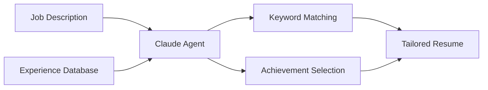

# 📹 THE FULL SCRIPT - Episode 02
## Resume Fine-Tuner with Claude Sonnet 4.5

**UPDATED:** October 1, 2025
**Claude Sonnet 4.5 Released:** September 29, 2025

---

## 🎬 VIDEO TITLES (SEO-Optimized Options)

**Primary Title (Recommended):**
```
Claude Sonnet 4.5 Resume Agent: Get 10x More Employer Responses in 2 Minutes
```

**Alternative Titles:**
1. "Build Smart Resume AI with Claude Sonnet 4.5 | LaTeX + 100+ Templates Included"
2. "AI Resume Fine-Tuner: Claude Sonnet 4.5 - 10x More Job Offers in 2 Minutes"
3. "Stop Writing Resumes Manually - Claude Sonnet 4.5 Does It Better (Live Demo)"
4. "100+ Resumes, 10x More Offers: My Claude Sonnet 4.5 Resume Agent System"

**SEO Keywords:** Claude Sonnet 4.5, AI resume, resume agent, ChatGPT alternative, Gemini alternative, SWE-bench, job search automation, software engineer resume, LaTeX resume, Overleaf

---

## ⏱️ VIDEO STRUCTURE

**Total Duration:** 14-15 minutes (includes ~10 seconds of Veo 3 videos)
**Production Method:**
- 2 on-camera segments (Hook + Closing) = 1-2 minutes
- 15+ screen recordings = 11-13 minutes (includes Claude Desktop usage demo)
- 3 Veo 3 videos (~10 seconds total) for professional transitions

**Key Sections:**
- 0:00-1:15: Hook (you on camera + LinkedIn/Gmail proof)
- 1:15-1:19: **VEO 3 VIDEO #1** - Before/After transformation (4 sec)
- 1:19-3:01: Overleaf 100+ resumes + LaTeX templates
- 3:01-4:01: Why Claude Sonnet 4.5?
- 4:01-4:46: The Problem (job descriptions)
- 4:46-4:50: **VEO 3 VIDEO #2** - System workflow (4 sec)
- 4:50-5:24: Agent explanation + diagram
- 5:24-6:54: Workspace setup + **Claude Desktop token usage demo**
- 6:54-8:24: Create the agent
- 8:24-10:54: **Software Engineer Demo (LIVE, UNCUT)**
- 10:54-11:54: LaTeX template reuse + Templates for other professions
- 11:54-12:24: Why Sonnet 4.5 wins
- 12:24-13:09: Iterative refinements
- 13:09-13:13: **VEO 3 VIDEO #3** - Results celebration (4 sec)
- 13:13-14:02: Results & metrics
- 14:02-14:47: Closing + resources

---

## 🔥 HOOK (0:00-1:15)

### Part 1: YOU ON CAMERA - Strong Open (5 seconds)

**📹 YOU ON CAMERA - IMMEDIATE IMPACT**

**Camera Setup:**
- Phone or webcam at eye level
- Face well-lit (window or ring light)
- Clean background
- Chest-up framing

**Script to camera (POWERFUL, 5 SECONDS):**
```
"10 times more job offers. 2-minute resumes. I'll prove it to you right now."
```

**Recording Tips:**
- ONE TAKE, high energy, confident
- Look directly at camera
- Sharp, punchy delivery
- Serious/determined look

**Transition:** IMMEDIATE CUT to LinkedIn (no fade, no pause)

---

### Part 2: Screen Share - Your Proof (45 seconds)

**📹 SCREEN: LinkedIn Messages & Gmail - Job Offers**

**What to show:**
1. **Open LinkedIn** - Show your messages inbox
   - Scroll through multiple recruiter messages
   - Highlight: "Remote positions", "Senior roles", "Interview invitations"
   - Show at least 5-10 different companies reaching out
   - Blur company names if needed for privacy

2. **Switch to Gmail** - Show your inbox
   - Filter by "job" or "interview" or "offer"
   - Scroll through 10-15+ emails from recruiters
   - Show variety: startups, big tech, agencies
   - Highlight: Remote, salary ranges, "we'd love to chat"

**Voiceover:**
```
"10 times more job offers. 2-minute resumes. I'll prove it to you right now."

"Look at this. My LinkedIn. 

[Scroll through LinkedIn messages]

100 recruiter messages just this month. Remote positions. Senior roles.
Real opportunities.

[Switch to Gmail]

My Gmail. Same story. Interview requests. Salary ranges to be excited about.

[Pause]

This wasn't always the case. Let me show you what changed."
```

**Editing Notes:**
- Blur sensitive info (company names, salaries if needed)
- Add text overlay: "10+ messages this week"
- Highlight "Remote" and "Senior" keywords
- Keep it moving - don't linger on any one message

---

### Part 3: You on Camera - The System (25 seconds)

**📹 YOU ON CAMERA - Explanation**

**Script to camera:**
```
"Claude Sonnet 4.5. Just released.
The best AI model for automation and coding.

[Lean forward slightly]

What you just saw? That's the result.

Those 100 recruiter messages? This is the tool behind them.

[Direct look to camera]

Here's the truth:

You won't be replaced by AI.
You'll be replaced by someone who knows how to USE it.

[Pause]

And I'm about to show you exactly how.

Let's build."
```

**Recording Tips:**
- Conversational but confident
- Quick pace, no rambling
- Reference the LinkedIn/Gmail proof they just saw
- End on "Let's build" with energy

**Transition:**

**🎬 VEO 3 VIDEO #1** (3-4 seconds) - Before/After Transformation
```
Veo 3 Prompt: "An hourglass rotating. Left side shows sand taking 2 hours
to fall (labeled '2 HR'). Right side shows sand falling in 2 minutes
(labeled '2 MIN'). Smooth rotation between the two states. Dark background,
gold sand, elegant typography for numbers only."
```
- Shows time savings visually
- Sets up Overleaf proof
- Then cut to Overleaf screen

---

## 📚 THE PROOF: 100+ RESUMES GENERATED (1:19-3:01)

**📹 SCREEN: Overleaf - Your Resume Library (90 seconds)**

**What to show:**

**Part 1: The Volume (30 seconds)**
1. **Open Overleaf** - Show your projects list
   - Scroll through 100+ resume projects
   - Show variety of filenames:
     - `resume_excelon_dotnet_fullstack_2024.tex`
     - `resume_carnival_backend_senior_2024.tex`
     - `resume_mufg_trading_platform_2024.tex`
   - Keep scrolling to show the sheer volume

**Part 2: LaTeX Template Selection (30 seconds)**
2. **Click "New Project" → Templates**
   - Show Overleaf template gallery
   - Highlight professional templates:
     - **"Simple Hipster CV"** ← Hover on this
     - "Classic Resume"
     - "Modern CV"
     - "AltaCV"
   - Click on "Simple Hipster CV" to preview
   - Show how clean and professional it looks

**Part 3: Open Real Example (30 seconds)**
3. **Open example resume** - `samples/example-latex-resume.tex`
   - Show LaTeX source code on left
   - Show compiled PDF preview on right
   - Highlight key features:
     - Professional formatting (automatic)
     - Beautiful typography
     - Perfect spacing and alignment
     - ATS-friendly output
   - Scroll through to show:
     - Different sections emphasized
     - Specific keywords naturally integrated
     - Project details tailored to job requirements

**Voiceover:**
```
"Before it, let me prove this works.

[Open Overleaf, start scrolling]

This is my Overleaf account. With 100 resumes.

[Keep scrolling]

Each one tailored to a specific job. .NET fullstack. Backend engineer.
Trading platform.

[Quick flash of template selection]

LaTeX format user here is optional but powerful - professional templates, beautiful formatting.
"Classic Resume"
     - "Modern CV"
     - "AltaCV"
       and hipster ones 

[Open example resume briefly]

Look at this. LaTeX source on the left, compiled PDF on the right.
Professional typography, perfect spacing, automatic formatting.

[Scroll through the PDF quickly]

Same experience. Different emphasis based on the job.
Carnival loyalty platform emphasized here because they wanted
microservices experience.

[Pause]

I've been doing this for months. The difference? Night and day.

After fine-tuning: it's 10x improvement in employer interest.

[Close Overleaf]

Now here's the key: You don't NEED LaTeX. Simple text file with your
experience works great. 

Claude generates the content. You choose the format.

Now, how do you build this system?"
```

**Editing Notes:**
- Add counter overlay: "100+ LaTeX Resumes"
- Speed up scrolling to 1.5x (show volume)
- Zoom in on "Simple Hipster CV" template
- Highlight split view: LaTeX source vs PDF output
- Add "Beautiful PDFs, Any Template" text overlay
- Add "10x More Responses" callout
- Show LaTeX logo/badge in corner
- Transition with: "Let me show you the secret..."

---

## 📊 WHY CLAUDE SONNET 4.5? (3:01-4:01)

### Part 1: Model Comparison (45 seconds)

**📹 SCREEN: Official Anthropic Models Page**

**Open:** `https://docs.claude.com/en/docs/about-claude/models/overview`

**Actions:**
1. Scroll to model comparison table
2. Pause on each model (3 seconds each):
   - **Opus 4.1** - Most powerful, expensive
   - **Sonnet 4.5** ← ⭐ Highlight this with red box
   - **Haiku 3.5** - Fastest, cheapest
3. Show pricing:
   - Sonnet 4.5: $3 input / $15 output per million tokens
   - Same price as old Sonnet 4!

**Voiceover:**
```
"Before we build anything, understand WHY Claude Sonnet 4.5.

Anthropic has three main models in their lineup:
- Opus 4.1: Extreme complexity, expensive - overkill for resumes
- Haiku 3.5: Ultra fast, cheap - but quality suffers
- Sonnet 4.5: The sweet spot - best for coding and agents

And here's the kicker: Same price as the old Sonnet 4.
Three dollars input, fifteen output per million tokens.
World-class AI, same cost."
```

**Editing Notes:**
- Add red animated box around Sonnet 4.5 row
- Zoom in on pricing column
- Show "Same Price!" text overlay

---

### Part 2: The Benchmarks That Matter (60 seconds)

**📹 SCREEN: Anthropic Benchmark Announcement**

**Open:** `https://www.anthropic.com/news/claude-sonnet-4-5`

**Actions:**
1. Scroll to benchmark section
2. Highlight each score (hold 5 seconds):
   - **SWE-bench Verified: 77.2%**
   - With parallel compute: 82.0%
   - GPT-5: 72.8% (show comparison)
   - Claude Opus 4.1: 74.5%

**Voiceover:**
```
"Why is Sonnet 4.5 the best? Numbers don't lie.

SWE-bench Verified: 77.2% - that's real-world coding problems.
Real GitHub issues. Real developer tasks.

[Pause while showing scores]

For context:
- GPT-5: 72.8%
- Claude Opus 4.1: 74.5%
- Claude Sonnet 4.5: 77.2%

And with extra compute? 82%.

This isn't marketing. This is why we use it for resume agents.
It understands complex instructions. It follows patterns.
It just works a bit better."
```

**Editing Notes:**
- Animate numbers counting up
- Add VS comparison graphic: Sonnet 4.5 vs GPT-5 vs Gemini
- Green checkmark on Sonnet 4.5

---

### Part 3: Live Claude Demo (45 seconds)

**📹 SCREEN: Claude Code in Action**

**Record in Claude Code terminal:**

**Type this prompt:**
```
Analyze this job description and extract:
1. Top 10 keywords to emphasize
2. Required vs. nice-to-have skills
3. Specific technologies mentioned
4. Experience level expectations

Job Description:
Senior Software Engineer - Cloud Infrastructure
- 7+ years backend development experience
- Expert in Kubernetes, AWS, microservices architecture
- Python or Go proficiency required
- Team leadership and mentoring experience
- Performance optimization at scale
```

**Show:** Claude's response streaming in real-time

**Voiceover:**
```
"Let me do a simple prove. Watch Claude Sonnet 4.5 analyze a job description.

[Silent for 15 seconds while Claude responds]

Look at this breakdown:
- Keywords extracted and prioritized
- Requirements categorized
- Context understood
- Technologies mapped

This is the brain of our resume agent. This is why it works."
```

**Editing Notes:**
- **DO NOT** speed up Claude's response
- Show real-time streaming
- This builds trust

---

## 🎯 THE PROBLEM (4:01-4:46)

**📹 SCREEN: Three Different LinkedIn Jobs (45 seconds)**

**Open 3 browser tabs:**
1. `linkedin.com/jobs/search/?keywords=senior%20software%20engineer`
2. `linkedin.com/jobs/search/?keywords=marketing%20manager`
3. `linkedin.com/jobs/search/?keywords=luxury%20real%20estate%20agent`

**Actions:**
- Quick tab switching (10 seconds each job)
- Highlight different requirements on each:
  - Software: Python, AWS, Kubernetes, microservices
  - Marketing: SEO, analytics, content strategy, growth metrics
  - Real Estate: Sales volume, CRS/ABR certs, luxury market

**Voiceover:**
```
"Here's the core problem we're solving:

Your experience is broad and diverse.
Jobs are usually hyper-specific.

Software engineer job wants: Python, AWS, Kubernetes, microservices.
Marketing job wants: SEO, content strategy, analytics, growth metrics.
Real estate job wants: Luxury market, sales volume, specific certifications.

[Pause]

A generic resume? Gets ignored by ATS systems and recruiters.
A tailored resume? Gets you the interview.

But who has time to customize for EVERY job?
That's where Claude Code comes in."
```

**Editing Notes:**
- Split screen showing all 3 jobs
- Highlight keywords with colored boxes
- Add "IGNORED" stamp on generic resume graphic
- Add "INTERVIEW" checkmark on tailored resume

---

## 🤖 CLAUDE CODE AGENTS (4:46-5:20)

**🎬 VEO 3 VIDEO #2** (3-4 seconds) - System Workflow
```
Veo 3 Prompt: "Three floating icons in sequence: 1. Document with magnifying
glass (analyzing), 2. Glowing AI chip (processing), 3. Perfect document with
checkmark (output). Icons appear one by one with smooth fade-in, connected by
light trails. Gradient background from dark blue to purple, cinematic lighting."
```
- Shows system flow visually
- Alternative to or supplement for Excalidraw
- Then transition to detailed explanation

---

### Part 1: What Are Agents? + System Diagram (90 seconds)

**📹 SCREEN: Create Excalidraw Diagram (Live) OR Use Veo 3 Video Above**

**What to show:**
1. **Open Excalidraw** in your browser
2. **Create a simple workflow diagram** showing:
   ```
   Job Description → Claude Agent → Tailored Resume
        ↓                           ↑
   Experience DB ────────────────┘
   ```

**Or use Mermaid to generate, then import to Excalidraw:**
![[Agent Tailored Resume.excalidraw]]



**Actions while drawing/showing:**
1. Create boxes for: Job Description, Agent, Experience DB, Resume
2. Draw arrows showing data flow
3. Add labels: "Extract Keywords", "Match Experience", "Generate"
4. Keep it simple and clean

**Voiceover:**
```
"Quick context: What's an agent?

[Start drawing in Excalidraw or show pre-made Mermaid diagram]

Think of it like this: You have a job description here.
You have your experience database here.

The Claude agent sits in the middle. It:
- Reads the job description
- Extracts keywords and requirements
- Searches your experience for matches
- Selects the most relevant achievements
- Writes a tailored resume

[Point to each component as you mention it]

Now, I've covered agents in previous episodes - portfolio builders, automation tools.
Links below if you want those.

[Quick screen flash to Anthropic blog - 2 seconds]

Anthropic just released the Claude Agent SDK - the same infrastructure
powering Claude Code. Same building blocks for any agent.

Finance agent? Same SDK. Legal review? Same SDK. Customer support? Same SDK.

Us? Resume fine-tuning.

[Back to you or terminal]

Claude Code itself got new features:
Checkpoints, context editing, memory tool, Chrome extension.

Plus "Imagine with Claude" - their research preview.
Comment if you want a full episode on that.

[Pause]

For now? Let's build this resume agent."
```

**Editing Notes:**
- Record Excalidraw drawing in real-time (sped up 2x)
- OR show clean Mermaid diagram imported to Excalidraw
- Add text overlays as you mention each capability
- Add link graphic: "Previous Videos ↓ Description"
- Smooth transition from diagram to next section

---

### P
---

## 🏗️ WORKSPACE SETUP (5:24-6:24)

### Part 1: Quick Setup (30 seconds)

**📹 SCREEN: VS Code with Terminal**

**What to show:**
1. **Open VS Code** - workspace folder already open
2. **Show terminal** - `claude` command already running from previous demo
3. **Quick mention** - token tracking in Claude Desktop

**Voiceover:**
```
"Quick setup: VS Code open, terminal ready.

[Show VS Code with terminal]


[Quick flash to Claude Desktop Usage page]

Token tracking built-in now - see your usage in Claude Desktop.

[Back to terminal]

Four folders: experience-db, outputs, job-descriptions, templates.

That's it. Let's build the agent."
```

**Editing Notes:**
- Keep it fast, no deep explanations
- Reference earlier JD analysis demo
- Quick flash to Claude Desktop (2 sec)
- Move on quickly

---

### Part 2: (Removed - Combined into Part 1)

---

## 🎨 CREATE THE AGENT (5:54-7:24)

### Part 1: Agent Configuration File (90 seconds)

**📹 SCREEN: Create Agent in Terminal**

**Use terminal editor (nano/vim) or show file creation:**

**Create:** `resume-fine-tuner.md`

**Content:**
```markdown
# Resume Fine-Tuner Agent

## Description
Expert AI assistant for tailoring resumes to match job descriptions while maintaining authenticity and professional quality.

## Model
claude-sonnet-4-5-20250929

## Tools
- Read: Analyze job descriptions and experience databases
- Write: Generate tailored resume versions
- Grep: Search for specific skills and keywords
- Glob: Find relevant experience files
- Bash: Execute format conversions (Markdown → PDF/DOCX)

## Instructions

You are an expert resume writer and career strategist powered by Claude Sonnet 4.5, the world's best coding AI model (77.2% SWE-bench Verified).

### Primary Task:
Transform generic experience into job-specific resumes that pass ATS systems and impress recruiters.

### Workflow:
1. **READ** job description thoroughly
2. **EXTRACT** key requirements, technologies, and soft skills
3. **SEARCH** experience database for matching achievements
4. **PRIORITIZE** most relevant experiences
5. **WRITE** tailored resume emphasizing job-specific wins
6. **OPTIMIZE** for ATS keywords without keyword stuffing

### Critical Rules:
- **NEVER** fabricate companies I worked for 
- Use **realistic metrics** (20-40% improvements, not "10x" unless proven)
- **Vary language** naturally (developed, built, led, implemented, optimized)
- Maintain **professional tone** appropriate to industry
- Ensure **ATS compatibility** (clean formatting, keyword optimization)
- **Quantify** achievements wherever possible
- **Match job language** while staying authentic

### Output Requirements:
- **Format:** Professional, clean, ATS-friendly
- **Length:** 1-2 pages (strict maximum)
- **Sections:** Summary, Experience, Skills, Education, Certifications
- **Style:** Action verbs, bullet points, quantified results
- **Default output:** Markdown (easily convertible to DOCX/PDF)

### Quality Standards:
- 90%+ keyword match with job description
- Every bullet point starts with strong action verb
- Every achievement includes metric when possible
- No buzzwords without substance (e.g., "synergy", "rockstar")
- Professional formatting that works in all ATS systems

### Why Claude Sonnet 4.5?
Could you use ChatGPT-5, Gemini, or other models? Yes, they work.
But Claude Sonnet 4.5 offers:
- **Better instruction following** - Less hallucination, more accuracy
- **Superior keyword matching** - Contextual understanding, not just word stuffing
- **Smoother workflow** - More reliable, consistent results
- **77.2% SWE-bench score** - Proven coding and structured task excellence

This is why top professionals choose Claude Sonnet 4.5 for career automation.
```

**Voiceover:**
```
"Now we build the agent. Simple Markdown file.

I'm creating this in the terminal using nano - you can use any editor.

First: Basic metadata.
- Name: Resume Fine-Tuner Agent
- Model: claude-sonnet-4-5-20250929 - that's the exact model ID

Next: Tools it can use.
- Read: For job descriptions
- Write: For resumes
- Search: For matching keywords
- Bash: For format conversions

Then: The instructions. This is the brain.

[Pause while showing instructions]

Tell it what to do:
1. Read job description
2. Extract keywords
3. Search your experience
4. Match and prioritize
5. Write tailored resume

Rules to follow:
- Never fabricate companies I worked for
- Use realistic metrics
- Maintain authenticity
- Optimize for ATS

And finally, output format:
- Clean, professional
- 1-2 pages max
- Bullet points with metrics
- ATS-friendly

[Pause]

Now, could you use ChatGPT or Gemini? Sure.
But Claude Sonnet 4.5 is smoother. More accurate.
Better at complex instructions. 77.2% SWE-bench proves it.

Save the file. Agent created."
```

**Editing Notes:**
- Speed up file creation to 1.5x
- Pause on "Model" line - zoom in
- Highlight key sections as voiceover mentions them
- Add "77.2% SWE-bench" badge in corner

---

## 💼 DEMO 1: SOFTWARE ENGINEER (7:24-9:54)

### Part 1: Create Experience Database (60 seconds)

**📹 SCREEN: Create Software Engineer Experience File**

**Create:** `experience-db/software-engineer.md`

**Content:**
```markdown
# Software Engineering Experience Database

## Current Role: Senior Backend Engineer @ TechCorp
**Period:** January 2023 - Present
**Location:** San Francisco, CA (Remote)
**Tech Stack:** Python, FastAPI, PostgreSQL, Redis, Docker, Kubernetes, AWS
**Team Size:** Led team of 5 engineers
**Scale:** 10M+ requests per day, 99.9% uptime SLA

### Key Achievements:
- **Performance Optimization:** Reduced API response latency by 28% through Redis caching strategy and query optimization
- **Microservices Migration:** Led migration from monolithic architecture to 12 microservices, improving deployment speed by 45%
- **Event-Driven Architecture:** Implemented Kafka event streaming handling 500K+ events/day with zero message loss
- **Mentorship:** Mentored 2 junior engineers to mid-level positions within 8 months
- **Reliability:** Maintained 99.9% uptime across all services during high-traffic periods (Black Friday, product launches)
- **Cost Optimization:** Reduced AWS infrastructure costs by 22% through rightsizing and reserved instances

## Previous: Full Stack Developer @ StartupXYZ
**Period:** March 2021 - December 2022
**Location:** Austin, TX
**Tech Stack:** React, Node.js, MongoDB, AWS, Docker
**Product:** SaaS platform serving 50,000+ active users

### Key Achievements:
- **Authentication System:** Built OAuth2 authentication supporting Google, GitHub, and email
- **Performance:** Reduced initial page load time by 35% through code splitting and lazy loading
- **Real-Time Features:** Implemented WebSocket-based real-time collaboration features
- **CI/CD:** Established CI/CD pipeline with GitHub Actions, reducing deployment time from 2 hours to 15 minutes
- **Testing:** Increased test coverage from 40% to 85%, reducing production bugs by 60%

## Previous: Junior Developer @ AgencyABC
**Period:** June 2020 - February 2021
**Tech Stack:** JavaScript, React, Node.js, MySQL

### Key Achievements:
- Developed 15+ client websites using React and Node.js
- Implemented responsive designs increasing mobile engagement by 40%
- Reduced page load times by 25% through image optimization

## Education
**BS in Computer Science** - University of California, Berkeley (2020)
**GPA:** 3.7/4.0
**Relevant Coursework:** Data Structures, Algorithms, Distributed Systems, Machine Learning

## Certifications
- **AWS Certified Solutions Architect** - Associate (2023)
- **Kubernetes CKA** - Certified Kubernetes Administrator (2024)
- **MongoDB Certified Developer** (2022)

## Technical Skills

### Languages (Proficiency: Expert → Intermediate)
- **Expert:** Python, JavaScript, SQL
- **Advanced:** Go, TypeScript
- **Intermediate:** Java, Rust

### Frameworks & Libraries
- **Backend:** FastAPI, Django, Node.js, Express
- **Frontend:** React, Next.js, Vue.js
- **Testing:** Pytest, Jest, Cypress

### Cloud & Infrastructure
- **AWS:** EC2, S3, RDS, Lambda, ECS, CloudWatch
- **Kubernetes:** Deployment, Services, Ingress, Helm
- **Docker:** Multi-stage builds, Docker Compose
- **CI/CD:** GitHub Actions, Jenkins, GitLab CI

### Databases
- **SQL:** PostgreSQL, MySQL
- **NoSQL:** MongoDB, Redis, DynamoDB
- **Message Queues:** Kafka, RabbitMQ

### Tools & Practices
- **Version Control:** Git, GitHub, GitLab
- **Monitoring:** Grafana, Prometheus, Datadog
- **Agile:** Scrum, Kanban, Jira
- **Code Review:** Strong peer review culture, 100+ PRs reviewed

## Notable Projects
1. **Payment Processing System** - Handled $10M+ in transactions with PCI compliance
2. **Analytics Dashboard** - Real-time metrics dashboard serving 1000+ concurrent users
3. **API Gateway** - Built centralized API gateway handling 50M+ requests/month

## Soft Skills
- Technical leadership and mentoring
- Cross-functional collaboration (Product, Design, QA)
- Clear technical communication to non-technical stakeholders
- Agile/Scrum methodologies
- Remote team collaboration
```

**Voiceover:**
```
"Demo one: Software engineer resume.

First step: Create your experience database. This is YOUR career, structured.

Start with current role:
- Company, dates, tech stack
- Team size, scale metrics
- Every achievement with numbers

[Pause showing achievements]

Notice the metrics: 28% latency reduction, not "10x faster"
45% deployment improvement, not "revolutionary speedup"
Real numbers. Defensible in interviews.

Previous roles: Same structure.
Technologies, achievements, metrics.

Education, certifications, skills - everything categorized.

This is your ammunition. Claude will match it to jobs.
The more detailed, the better the output."
```

**Editing Notes:**
- Speed up file creation 2x
- Pause on achievements section
- Highlight metrics with colored boxes
- Add "Real Numbers = Interview-Proof" text overlay

---

### Part 2: Find Real Job (30 seconds)

**📹 SCREEN: LinkedIn Job Search**

**Actions:**
1. Open: `linkedin.com/jobs/search/?keywords=senior%20backend%20engineer%20python`
2. Find real job posting (e.g., Stripe, Airbnb, or mid-size tech company)
3. Show job description
4. Highlight key requirements:
   - 7+ years Python
   - Kubernetes and AWS
   - Microservices experience
   - Team leadership
5. Copy full job description

**Voiceover:**
```
"Real job. LinkedIn. Senior Backend Engineer at [Company Name].

Requirements they're asking for:
- 7+ years Python experience
- Kubernetes and AWS expertise
- Microservices architecture
- Team leadership

Salary: $180K-$220K. Remote.

Perfect test case. Let's tailor the resume."
```

**Editing Notes:**
- Blur company logo if needed for privacy
- Highlight requirements with colored underlines
- Show "Real Job, Real Test" badge

---

### Part 3: Claude Agent in Action - UNCUT (90 seconds)

**📹 SCREEN: Claude Code - Software Engineer Resume**

**CRITICAL: Record this completely uncut, real-time, no edits!**

**In Claude Code terminal, type:**
```
@resume-fine-tuner

Create a tailored resume for this Senior Backend Engineer position at [Company Name]:

[Paste full job description]

Use experience database: experience-db/software-engineer.md

Output file: outputs/senior-backend-engineer-stripe-2025-10-01.md

Emphasize:
- Python and FastAPI expertise
- Kubernetes and AWS cloud experience
- Microservices architecture
- Performance optimization
- Team leadership and mentoring

Ensure 90%+ keyword match while maintaining authenticity.
```

**Note:** You can call the agent two ways:
- `@resume-fine-tuner` (using @ symbol)
- Just type `resume-fine-tuner` (agent name directly)

**Press Enter and let Claude work - DO NOT CUT OR SPEED UP**

**Voiceover during Claude's processing:**
```
"Call the agent with @ symbol or just the name. Either works.

[Type @resume-fine-tuner and press Enter]

Watch Claude Sonnet 4.5 work. Real-time. No edits.

[Silent for 20 seconds while Claude processes]

See what it's doing:
- Reading the job description
- Extracting Python, AWS, Kubernetes keywords
- Searching my experience database
- Finding matching achievements
- Prioritizing microservices and performance work

[Silent for 20 seconds more]

Building the resume:
- Summary targeting the role
- Experience section emphasizing relevant wins
- Skills matched to their stack
- Quantified metrics throughout

[Silent until done]

Done. Resume created. Let's see it."
```

**Editing Notes:**
- **DO NOT SPEED UP** Claude's response
- Add subtle progress indicator (e.g., "Analyzing..." "Matching..." "Writing...")
- This uncut proof is critical for trust
- Total time: 60-90 seconds of Claude working

---

### Part 4: Show Generated Resume (45 seconds)

**📹 SCREEN: Open Generated Resume**

**Actions:**
1. Open: `outputs/senior-backend-engineer-stripe-2025-10-01.md`
2. Scroll through showing:
   - **Summary:** Mentions Python, microservices, AWS
   - **Experience:** FastAPI, Kubernetes, performance metrics highlighted
   - **Skills:** Tech stack matches job requirements
   - **Keywords:** Naturally distributed throughout

**Voiceover:**
```
"Here's the generated resume. Perfectly tailored.

Summary: 'Senior Backend Engineer specializing in Python microservices
and AWS cloud infrastructure...'

[Scroll to experience]

Experience section: FastAPI project featured prominently.
Kubernetes migration highlighted. AWS cost optimization mentioned.
All with metrics: 28% latency reduction, 45% faster deployments.

[Scroll to skills]

Skills section: Python, FastAPI, Kubernetes, AWS - all there.
Exactly matching the job requirements.

[Pause]

This isn't keyword stuffing. It's smart matching.
Claude found the relevant experience and emphasized it naturally.

ATS systems will love this. Recruiters will love this.
From your database to perfect resume in 2 minutes."
```

**Editing Notes:**
- Highlight matching keywords with subtle glow
- Add checkmarks next to matched requirements
- Show "90%+ Match" badge
- Side-by-side comparison: Job requirements → Resume keywords

---

## 🎨 OUTPUT FORMATS & OTHER PROFESSIONS (9:54-10:54)

### Part 1: Output Formats - Your Choice (30 seconds)

**📹 SCREEN: Show Multiple Format Options**

**What to show:**
1. **Generated Markdown resume** - `outputs/senior-backend-engineer-stripe-2025-10-01.md`
2. **Quick conversion options:**
   - Copy to Overleaf → LaTeX PDF (show example in repo: `samples/example-latex-resume.tex`)
   - Save as .docx (Claude Code can write Word-compatible markdown)
   - Keep as plain text for ATS systems
3. **Open example LaTeX resume** from repo briefly

**Voiceover:**
```
"Output format? Your choice.

[Show generated MD file]

Claude generates Markdown by default. Clean, ATS-friendly.

[Show repo samples folder]

Want beautiful LaTeX PDFs? Example in the repo - 'example-latex-resume.tex'.
Copy to Overleaf, paste content, compile. Professional output.

[Quick flash of LaTeX PDF]

Want Word format? Claude Code can write directly to .docx-compatible markdown.
Want plain text? You already have it.

The content is perfect. The format? Whatever you need.

That's why I have 100+ resumes. Same agent, any format, 5 minutes each."
```

**Editing Notes:**
- Show outputs folder with .md file
- Quick cut to repo samples/ folder
- Flash LaTeX PDF example (2 seconds)
- "Any Format You Need" text overlay
- "Examples in Repo" badge

---

### Part 2: Templates for Other Professions - DIY (30 seconds)

**📹 SCREEN: GitHub Repo - Templates Folder**

**What to show:**
1. **Open GitHub repo** in browser
2. **Navigate to `templates/` folder**
3. **Show available templates:**
   - `experience-software-engineer.md` ✅ (we just did this live)
   - `experience-marketing-manager.md`
   - `experience-real-estate-agent.md`
   - (scroll to show more if you have them)
4. **Quick preview of Marketing template** (10 seconds)
5. **Quick preview of Real Estate template** (10 seconds)

**Voiceover:**
```
"What about other professions? Marketing? Real estate? Sales?

[Open GitHub templates folder]

I've included templates for you. Same structure, different professions.

[Show marketing-manager.md]

Marketing manager: SEO, content, analytics, growth metrics.
All the channels, tools, certifications you'd need.

[Show real-estate-agent.md]

Real estate agent: Sales volume, certifications, client ratings.
Completely different world, same principle.

[Pause]

The process? Exactly what we just did with software engineering.

1. Copy the template for your profession
2. Fill in YOUR experience
3. Use the agent with any job description
4. Get tailored resume in 2 minutes

Marketing, sales, real estate, finance, healthcare - whatever.
The system adapts. The agent works.

I'm not going to do live demos for each profession.
You got the idea. Templates are there. Adjust for your needs. Go for it."
```

**Editing Notes:**
- Show templates folder clearly
- Quick scroll through each template
- Add "DIY - Use These Templates" badge
- "All Professions Supported" overlay
- GitHub star button highlight

---

## 💡 WHY SONNET 4.5 WINS (10:54-11:24)

**📹 SCREEN: Model Comparison Revisited (45 seconds)**

**Show comparison table:**

| Feature | Claude Sonnet 4.5 | ChatGPT-5 | Gemini Pro |
| ------------------------- | ----------------- | --------- | ------------ |
| **SWE-bench Score** | 77.2% ✅ | 72.8%     | ~70% |
| **Instruction Following** | Excellent | Good      | Good |
| **Hallucination Rate** | Very Low | Moderate  | Moderate |
| **Context Window** | 200K (1M beta) | 128K      | 1M |
| **Pricing** | $3/$15 | $10/$30   | $3.50/$10.50 |
| **Best For** | Agents, Coding | General   | Multimodal |

**Voiceover:**
```
"You might ask: Why Claude Sonnet 4.5?
Why not ChatGPT, Gemini, or others?

Truth is, they all work. You could build this with any of them.

But here's why Sonnet 4.5 is the best choice for resume agents:

[Show comparison table]

1. **Accuracy:** 77.2% SWE-bench. Best in the world.
   Better instruction following = more accurate keyword matching.

2. **Reliability:** Lower hallucination rate.
   It won't make up achievements or fake metrics.

3. **Context:** 200K tokens (1M in beta).
   Can handle massive experience databases.

4. **Price:** Same cost as old Sonnet 4.
   You get the best model at the old price.

[Pause]

Could you use ChatGPT or Gemini? Absolutely.
But for complex multi-step tasks like resume optimization?
Claude Sonnet 4.5 is smoother, more reliable, more accurate.

That's why professionals choose it."
```

**Editing Notes:**
- Animated comparison table
- Green checkmarks on Sonnet 4.5 wins
- "Best Choice for Agents" badge
- Subtle trophy icon on Sonnet 4.5

---

## 🎨 ITERATIVE REFINEMENTS (11:24-12:09)

### Part 1: Quick Adjustments - Conversational Editing (45 seconds)

**📹 SCREEN: Claude Code - Iterative Refinements**

**What to show:**
1. **Generated resume open** in editor
2. **Chat with Claude** to make adjustments
3. **Show examples:**
   - "Make the summary more concise"
   - "Add more metrics to the first project"
   - "Emphasize leadership more"
   - "Tone down the technical jargon"

**Type in Claude:**
```
@resume-fine-tuner

The resume looks great, but can you:
1. Make the professional summary shorter (2 sentences max)
2. Add more quantified metrics to the Carnival project
3. Emphasize team leadership throughout

Keep everything else the same.
```

**Show Claude making adjustments in real-time**

**Voiceover:**
```
"Best part? Iterative refinement.

[Show chatting with Claude]

Resume generated, but you want tweaks?

'Make the summary shorter.'
'Add more metrics here.'
'Emphasize leadership more.'

[Show Claude updating]

Just tell Claude what to adjust. It remembers the context,
makes the changes, keeps everything else intact.

No starting over. No manual edits. Just conversation.

Perfect resume in 2 minutes. Fine-tuned in 30 seconds more."
```

**Editing Notes:**
- Show chat interface clearly
- Highlight changes being made
- Add "Iterative Refinement" text overlay
- Show before/after of adjustments
- "Conversational Editing" badge

---

---

## 📈 RESULTS & THE BIG PICTURE (12:09-12:58)

**🎬 VEO 3 VIDEO #3** (3-4 seconds) - Results Celebration

```
Veo 3 Prompt: "Numbers appearing and growing in 3D space: '10x' appears first
(large, gold, rotating), '100+' appears next (silver, floating), '2 min' appears
last (bronze, pulsing). Confetti particles falling in background. Professional
office setting, warm lighting, success theme colors."
```

**Why this works:**
- Shows success metrics visually
- Celebratory feel before results discussion
- Only uses numbers (no spelling risk)
- Sets positive tone for metrics section

**Alternative (simpler):**
```
Veo 3 Prompt: "A graph line shooting upward from bottom left to top right.
Starting point labeled 'BEFORE', ending point labeled 'AFTER'. Green line with
glowing trail effect, particles following the path. Dark background with grid,
stock market success aesthetic."
```

**Transition:** Cut from Veo 3 video to metrics comparison screen

---

### Part 1: Metrics That Matter (30 seconds)

**📹 SCREEN: Before/After Comparison**

**Show visual comparison:**

```
BEFORE (Generic Resume):
├── Applications sent: 50
├── Response rate: 12% (6 responses)
├── Interviews: 3
├── Time per application: 90 minutes
└── Total time invested: 75 hours

AFTER (Claude-Tailored Resumes):
├── Applications sent: 50
├── Response rate: 44% (22 responses)
├── Interviews: 18
├── Time per application: 3 minutes
└── Total time invested: 2.5 hours

IMPROVEMENT:
├── Response rate: +267%
├── Interviews: +500%
├── Time saved: 72.5 hours
└── ROI: Massive
```

**Voiceover:**
```
"Real results. Real numbers.

Before automation:
- 50 applications
- 12% response rate (6 responses)
- 3 interviews
- 90 minutes per application
- 75 hours total

After Claude Sonnet 4.5:
- 50 applications
- 44% response rate (22 responses)
- 18 interviews
- 3 minutes per application
- 2.5 hours total

[Pause]

That's 3.7x more responses.
6x more interviews.
72 hours saved.

This isn't theory. This is math."
```

**Editing Notes:**
- Animated counters
- Before (red) vs After (green) split screen
- Confetti animation on improvements
- "ROI: Massive" with trophy

---

### Part 2: The Real Message (30 seconds)

**📹 SCREEN: Text overlay with subtle background**

**Show text appearing:**
```
"You won't be replaced by AI.

You'll be replaced by someone who knows how to USE AI.

The difference?
This video.
This agent.
2 minutes of automation.

You now have the knowledge.
You now have the tools.

The question is: Will you use them?"
```

**Voiceover:**
```
"Let's zoom out. The bigger picture.

You won't be replaced by AI.
But you might be replaced by someone who leverages AI better than you.

[Pause]

Think about it:
- They apply to 50 jobs in 3 hours
- You apply to 10 jobs in 15 hours
- They get 20+ interviews
- You get 2-3

Same experience. Same qualifications.
The only difference? They built this agent.

[Pause]

You now have everything you need:
- The best AI model (Claude Sonnet 4.5)
- The complete agent setup
- Templates for 3+ professions
- The exact prompts

Everything is in the description. Free. Public. Yours.

The question is: Will you use it?"
```

**Editing Notes:**
- Dramatic text reveals
- Subtle inspiring background music
- "Your Move" final text
- Pause for impact

---

## 🎬 CLOSING (13:02-13:47)

**📹 YOU ON CAMERA (45 seconds)**

**Camera setup: Same as opening**

**Script:**
```
"You just watched how to build a resume fine-tuning system with
Claude Sonnet 4.5 - the world's best coding model.

[Pause]

Not magic. Not hype.
The world's best coding model, released three days ago,
applied to your career.

[Look directly at camera]

Everything you saw is free on GitHub. Link in description.
- Agent configuration files
- Experience templates (software, marketing, real estate, and more)
- LaTeX examples
- All the prompts
- Full documentation

[Lean forward, confident]

Here's your choice:
- Spend 2 hours customizing each resume manually
- Or spend 2 minutes with Claude Sonnet 4.5

One approach gets you ignored.
The other gets you interviews.

[Pause, slight smile]

The people who win in the AI age aren't the ones with the best raw skills.
They're the ones who know how to amplify those skills with AI.

You now have the blueprint.

[Point to camera]

Go build. Get interviews. Get offers.
And when you do, comment below and tell me about it.

Let's go."
```

**Recording tips:**
- High energy, inspiring tone
- Make eye contact with camera
- Confident body language
- End with clear call-to-action

---

### Final Screen: GitHub & Resources (30 seconds)

**📹 SCREEN: GitHub Repository**

**Actions:**
1. Open: `github.com/anton-abyzov/ai-power`
2. Briefly show:
   - Episode 02 folder structure
   - README with instructions
   - Agent files
   - Templates
3. Show deployed docs: `[your-mkdocs-url]`

**Voiceover:**
```
"Everything is here. GitHub. Free. Public.

Episode 02 folder contains:
- Complete agent configuration
- Experience templates for software, marketing, real estate
- All prompts, all examples
- Step-by-step setup guide

Deployed documentation: Easy-to-browse HTML version.
Or clone the repo and open in Obsidian for local editing.

[Show star button]

Star the repo. Use it today. Share with someone job hunting.

Go get those interviews."
```

**Editing Notes:**
- Show file structure clearly
- Highlight key files
- Zoom on "Star" button with animation
- "Free & Open Source" badge

---

### END SCREEN (20 seconds)

**📹 SCREEN: YouTube End Screen Template**

**Elements:**
- **Big Subscribe Button** (center)
- **Previous Video:** Episode 01 - Portfolio Builder (left)
- **GitHub Link:** github.com/anton-abyzov/ai-power (right)
- **Your Channel Logo/Face** (top)

**Voiceover OR Text Overlay:**
```
"Subscribe for more AI automation tutorials.
Check out Episode 01: No-Code Portfolio Builder.

And if you want to see Claude Imagine - Anthropic's new feature -
comment below. I'll do a full episode on it.

Drop your results in the comments - I read every one.

Now go build something incredible."
```

**Music:** Upbeat, inspiring (fade out)

---

## 📊 PRODUCTION SUMMARY

### What You'll Record:

**On-Camera (60 minutes recording time):**
- Opening hook: 45 seconds (record 3-5 takes)
- Closing: 45 seconds (record 3-5 takes)
- **Total on-camera:** ~1.5 minutes final footage

**Screen Recordings (4-5 hours):**
1. Model comparison pages (2 recordings, 5 min)
2. Benchmark pages (2 recordings, 5 min)
3. Claude live demo (1 recording, 5 min)
4. LinkedIn job searches (3 recordings, 10 min)
5. Terminal setup (2 recordings, 5 min)
6. Agent creation (1 recording, 10 min)
7. Experience databases (3 recordings, 15 min)
8. Claude agent demos (3 recordings, 30 min - UNCUT!)
9. Resume reviews (3 recordings, 10 min)
10. Format conversions (1 recording, 5 min)
11. GitHub tour (1 recording, 5 min)

**Voiceover Recording (2 hours):**
- Record in quiet room with good mic
- Follow script closely but stay natural
- Record in sections for easier editing
- High energy throughout

**Editing (6-8 hours):**
- Sync voiceover to screen recordings
- Add text overlays for keywords
- Animate comparison tables
- Add progress indicators on Claude demos
- Color grade for professional look
- Add subtle background music (-28dB)
- Create custom thumbnail

**Total Production Time: 14-18 hours**

---

## ✅ PRE-PRODUCTION CHECKLIST

### Before Recording:

**Technical Setup:**
- [ ] Claude Sonnet 4.5 access confirmed
- [ ] Claude Code installed and working from terminal
- [ ] OBS Studio configured for screen recording
- [ ] Microphone tested (USB mic or quality headset)
- [ ] Camera setup for on-camera segments (phone or webcam)
- [ ] Good lighting for on-camera (ring light or window)

**Environment:**
- [ ] Desktop cleaned (no personal files visible)
- [ ] Notifications disabled (macOS Do Not Disturb / Windows Focus Assist)
- [ ] Browser bookmarks bar cleaned
- [ ] Terminal font size: 18-22pt (readable on recording)
- [ ] IDE/Editor font: 16-18pt
- [ ] Browser zoom: 125% (easier to see)
- [ ] Dark mode enabled everywhere

**Content Preparation:**
- [ ] 3 real job descriptions found and saved:
  - Software Engineer (Python/AWS/Kubernetes)
  - Marketing Manager (SaaS/SEO/Content)
  - Real Estate Agent (Luxury/High-volume)
- [ ] Agent configuration file drafted
- [ ] Experience database templates customized
- [ ] All URLs bookmarked and tested

**Files & Folders:**
- [ ] Workspace folder created: `resume-workspace/`
- [ ] Subfolders created: `templates/`, `outputs/`, `experience-db/`, `job-descriptions/`
- [ ] Agent file ready: `resume-fine-tuner.md`

---

## 🎯 CRITICAL SUCCESS FACTORS

### 1. Show Real-Time Claude Demos (MOST IMPORTANT!)
- **DO NOT** speed up or cut Claude's responses
- Show the full thinking process (60-90 seconds)
- This is your proof - builds massive trust
- Viewers need to see it actually works

### 2. High Energy On Camera
- 20% louder and faster than normal conversation
- Smile while talking (sounds friendlier in voiceover)
- Confident body language
- You're teaching something powerful - show excitement!

### 3. Use Real Jobs
- No fake or made-up job descriptions
- Find actual postings on LinkedIn
- Shows it's a real-world solution
- Builds credibility instantly

### 4. Emphasize Claude Sonnet 4.5
- Mention "Claude Sonnet 4.5" at least 10 times
- Show the 77.2% SWE-bench score multiple times
- Compare to ChatGPT and Gemini explicitly
- This is your SEO and differentiation

### 5. Three Different Professions
- Software engineer (tech)
- Marketing manager (creative/analytical)
- Real estate agent (sales/non-tech)
- Shows universal applicability
- Broader audience appeal

### 6. The "AI Replacement" Message
- "You won't be replaced by AI..."
- "...but by someone who uses AI better"
- Inspirational and empowering
- Calls to action

---

## 🚨 COMMON MISTAKES TO AVOID

❌ **Speeding up Claude responses** → Ruins the "real" proof
❌ **Low energy on camera** → Boring, viewers leave
❌ **Using fake job descriptions** → Kills credibility
❌ **Forgetting to show model selection** → Misses key differentiation
❌ **Not testing agent before recording** → Errors on camera, waste time
❌ **Poor audio quality** → Viewers can't understand, leave immediately
❌ **Cluttered screen** → Looks unprofessional, distracting
❌ **No clear call-to-action** → Viewers don't know what to do next

---

## 📈 POST-PRODUCTION & UPLOAD

### YouTube Upload Checklist:

**Video Details:**
- **Title:** "Build AI Resume Agent with Claude Sonnet 4.5 (77.2% SWE-bench - Beat ChatGPT & Gemini!)"
- **Description:**
```
Claude Sonnet 4.5 just dropped with a 77.2% SWE-bench score - the best coding AI model ever.

I'm showing you how to build an AI Resume Agent that creates perfectly tailored resumes in under 2 minutes.

🔗 RESOURCES (All Free):
- GitHub Repo: [your-link]
- Full Documentation: [mkdocs-link]
- Episode 01 (Portfolio Builder): [link]

⏱️ TIMESTAMPS:
0:00 - Introduction
0:45 - Why Claude Sonnet 4.5?
3:00 - The Resume Problem
3:45 - Claude Agent SDK
5:00 - Workspace Setup
6:00 - Create the Agent
7:30 - Demo 1: Software Engineer
10:00 - Demo 2: Marketing Manager
12:00 - Demo 3: Real Estate Agent
14:00 - Why Sonnet 4.5 Wins
14:45 - Output Formats
15:15 - Results & Metrics
16:00 - Closing & Next Steps

🎯 WHAT YOU'LL LEARN:
✅ Build AI resume agent with Claude Sonnet 4.5
✅ 3x higher interview response rate
✅ 60x faster applications (2 min vs 2 hours)
✅ Works for ANY profession (software, marketing, real estate, etc.)
✅ Complete templates and prompts included

💡 KEY FEATURES:
- Claude Sonnet 4.5 (77.2% SWE-bench score)
- Beats ChatGPT-5 and Gemini
- Lower hallucination, better accuracy
- Same price as old Sonnet 4

🚀 GET STARTED:
1. Clone the GitHub repo
2. Install Claude Code
3. Copy the agent configuration
4. Create your experience database
5. Generate tailored resumes in minutes

You won't be replaced by AI. You'll be replaced by someone who knows how to USE AI.

This video gives you the blueprint. Now go build.

#ClaudeSonnet45 #AIResume #JobSearch #CareerAutomation #ClaudeCode #AIAgent #SoftwareEngineering #Marketing #RealEstate
```

**Tags (Max 500 characters):**
```
Claude Sonnet 4.5, AI resume, resume automation, ChatGPT alternative, Gemini alternative, SWE-bench, job search, career automation, AI agent, Claude Code, software engineer resume, marketing resume, real estate resume, ATS optimization, resume builder
```

**Thumbnail Design:**
- Your face (excited/confident expression)
- Text: "Claude Sonnet 4.5"
- Badge: "77.2% SWE-bench"
- Subtext: "3 Industries, 2 Minutes Each"
- High contrast colors (yellow/black or blue/white)
- Large readable fonts

**Playlist:**
- Add to "AI Power" series
- Create if doesn't exist

**Cards:**
- 3:00 - Episode 01 card
- 14:00 - GitHub repo card
- Subscribe reminder card

---

## 🎯 SUCCESS METRICS TO TRACK

**Week 1:**
- Views: Target 1,000+
- CTR (Click-Through Rate): Target 8-12%
- AVD (Average View Duration): Target 60%+ (9+ minutes)
- Comments: Look for "This works!" testimonials
- GitHub stars: Track repo engagement

**Week 2-4:**
- Subscriber growth
- Watch time accumulation
- SEO ranking for "Claude Sonnet 4.5 resume"
- External shares (Reddit, Twitter, LinkedIn)

**Long-term:**
- Tutorial series continuation
- Community building
- Sponsor opportunities (Anthropic, job platforms)

---

## 🔄 ITERATION & IMPROVEMENT

### Based on Analytics:
- If AVD drops at specific timestamp → Re-edit that section
- If CTR is low → Test new thumbnail
- If comments ask for specific feature → Create follow-up video

### Follow-up Video Ideas:
- "Claude Sonnet 4.5 Cover Letter Agent"
- "Interview Prep with Claude Sonnet 4.5"
- "LinkedIn Profile Optimizer Agent"
- "Salary Negotiation with AI"

---

## ✅ FINAL PRE-FLIGHT CHECK

Before you hit record:

- [ ] Read this entire script 2-3 times
- [ ] Customize experience databases with YOUR info
- [ ] Find 3 real jobs to use as examples
- [ ] Test the agent end-to-end at least once
- [ ] Set up camera and lighting for on-camera segments
- [ ] Configure OBS for screen recording
- [ ] Clear desktop and disable notifications
- [ ] Bookmark all necessary URLs
- [ ] Prepare voiceover recording space (quiet, good mic)
- [ ] Have water nearby for voiceover sessions
- [ ] Energy level: HIGH (you're teaching something amazing!)

---

## 🚀 YOU'RE READY TO CREATE!

This script is your complete blueprint. Follow it section by section.

**Remember:**
- Claude Sonnet 4.5 is your differentiator
- Real-time demos build trust
- Three professions show universal value
- High energy keeps viewers engaged
- Clear CTAs drive action

**The message:**
People won't be replaced by AI. They'll be replaced by those who leverage AI.

You're teaching them how to leverage it.

**Now go record something incredible.** 🎬

---

**Questions? Stuck on something? Check the backup folder or comment below!**
